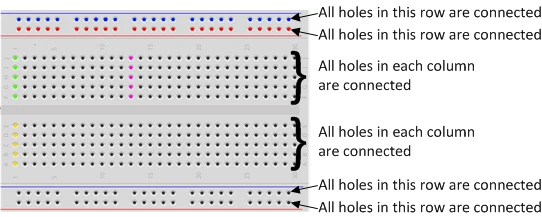

# IoT

## Breadboard

The breadboard is a way of connecting electronic components to each other without having to solder them together. They are often used to test a circuit design before creating a Printed Circuit Board (PCB).

The holes on the breadboard are connected in a pattern.

## LED

When you pick up the LED, you will notice that one leg is longer than the other. The longer leg (known as the ‘anode’), is always connected to the positive supply of the circuit. The shorter leg (known as the ‘cathode’) is connected to the negative side of the power supply, known as ‘ground’.LED stands for Light Emitting Diode, and glows when electricity is passed through it.

LEDs will only work if power is supplied the correct way round (i.e. if the ‘polarity’ is correct). You will not break the LEDs if you connect them the wrong way round – they will just not light. If you find that they do not light in your circuit, it may be because they have been connected the wrong way round.

## The Resistor

Resistors are a way of limiting the amount of electricity going through a circuit; specifically, they limit the amount of ‘current’ that is allowed to flow. The measure of resistance is called the Ohm (Ω), and the larger the resistance, the more it limits the current. The value of a resistor is marked with coloured bands along the length of the resistor body.
