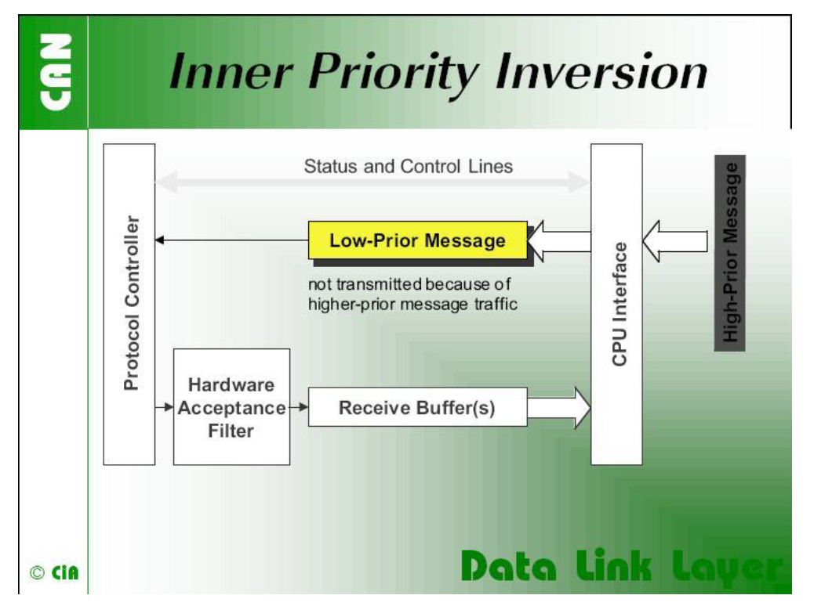
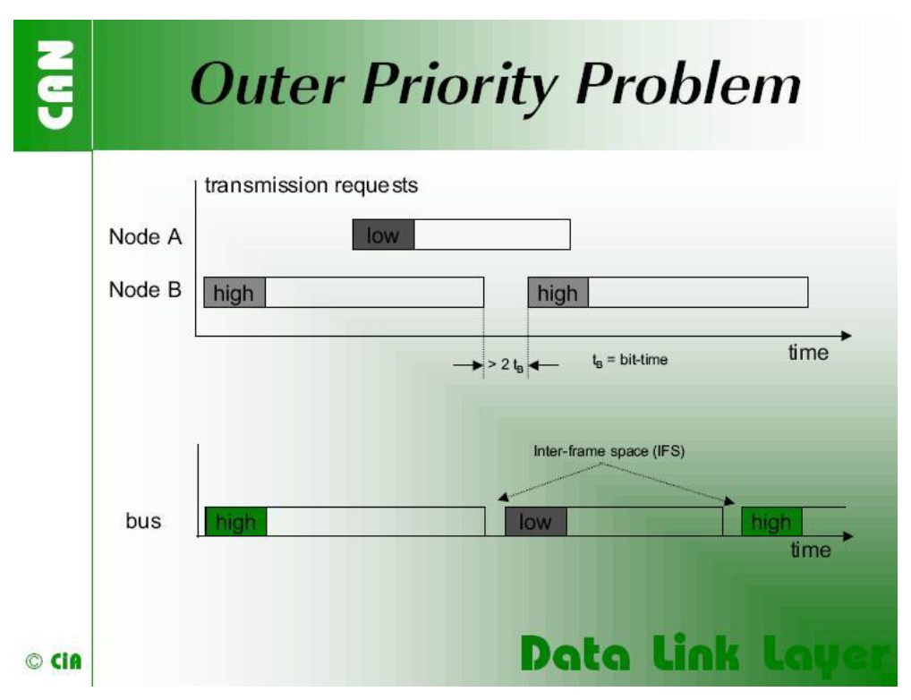
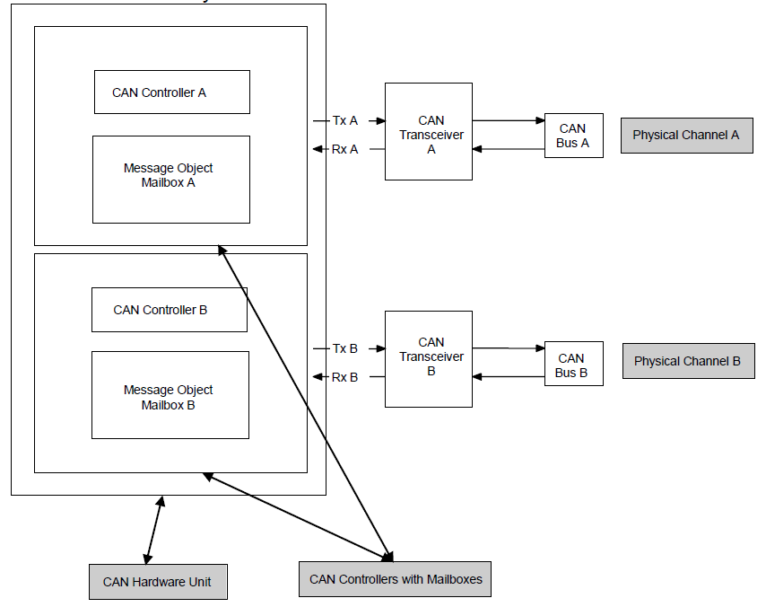
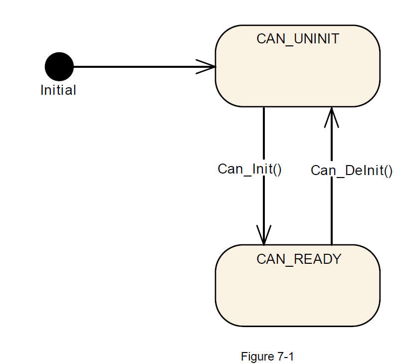

<section id="title">AUTOSAR CAN（CAN Driver）<section>

# 1. 简介和功能概述

本文介绍了AUTOSAR基础软件模块CAN驱动程序的功能、API和配置。

**Can**模块是底层的一部分，主要执行硬件访问，并向上层提供与硬件无关的API。只有上层模块**CanIf**模块能够唯一访问**Can**模块的。

**Can**模块为发起传输，并调用**CanIf**模块的回调函数来通知事件提供服务，它独立于硬件。此外，它还提供控制属于同一CAN硬件单元（**CAN Hardware Unit**）的CAN控制器（**CAN controller**）的行为和状态的服务。多个CAN控制器可以由一个CAN模块控制，只要它们属于同一个CAN硬件单元。

# 2. 术语

| 术语    |   中文                 | 描述                                |
| --------- | ------------------ | ----------------------------------- |
| CAN controller| CAN控制器  | 一个CAN控制器仅服务于一个物理通道。 |
|CAN Hardware Unit| CAN硬件单元| CAN硬件单元可以由一个或多个相同类型的CAN控制器和一个或多个CAN RAM区域组成。CAN硬件单元可以是片上设备，也可以是外部设备。CAN硬件单元由一个CAN驱动程序表示。|
|CAN L-PDU|CAN L-PDU|数据链路层协议数据单元。由标识符（**Identifier**）、数据长度（**Data Length**）和数据（**Data SDU**）组成。（见[19]）
|CAN L-SDU| CAN L-SDU |数据链路层服务数据单元。在L-PDU内部传输的数据。(见[19])|
|DLC|Data Length Code|CAN报文中有部分描述SDU的长度|
|Hardware Object|硬件对象|CAN硬件对象定义为CAN硬件单元或者CAN控制器的CAN RAM中的一个PDU缓冲区。硬件对象定义为CAN硬件单元CAN RAM中的L-PDU缓冲器。|
|HRH|Hardware Receive Handle|硬件接收句柄（**HRH**）由CAN驱动程序定义和提供。每个HRH通常只表示一个硬件对象。HRH可用于软件过滤的优化。|
|HTH|Hardware Transmit Handle|硬件传输句柄（**HTH**）由CAN驱动程序定义和提供的。每个HTH通常只表示一个或多个硬件对象，这些硬件对象被配置为硬件传输缓冲池。|
|Inner Priority Inversion|内部优先级反转|高优先级的**L-PDU**的传输由于在同一个发送硬件对象中存在一个未决的低优先级的L-PDU而被阻止。|
|L-PDU Handle|L-PDU句柄|L-PDU句柄被定义并放置在CanIf模块层内。通常每个句柄代表一个L-PDU，它是一个包含Tx/Rx处理信息的常量结构。|
|Outer Priority Inversion|外优先级反转|由于两个连续发送的**L-PDU**之间存在时间间隔。在这种情况下，来自另一个节点的低优先级的**L-PDU**可以阻止发送自己的高优先级的**L-PDU**。此时，高优先级的**L-PDU**不能参与网络访问仲裁，因为低优先级的**L-PDU**已经赢得了仲裁。|
|Physical Channel|物理信道|一个物理通道代表一个从CAN控制器到CAN网络的接口。CAN硬件单元的不同物理通道可能访问不同的网络。|
|Priority|优先级|**CAN L-PDU**的优先级由CAN标识符（**CAN Identifier**）表示。标识符的数值越低，优先级越高。|
|SFR|Special Function Register|控制控制器行为的硬件寄存器|
|SPAL| Standard Peripheral Abstraction Layer| 标准外围抽象层|

# 3. 优先级反转

## 3.1. 内部优先级反转（Inner Priority Inversion）

如果只使用一个发送缓冲区，内部优先级反转可能会发生。由于低优先级，存储在缓冲区中的消息要等到“总线上的流量平静下来。在等待的时间内，该消息可以阻止由同一微控制器产生的高优先级消息在总线上传输。

## 3.2. 外部优先级反转（Outer Priority Inversion）

在某些CAN实现中可能会出现外部优先级反转的问题。

假设CAN节点希望传输一个连续的高优先级消息包，这些消息包被存储在不同的消息缓冲区中。如果在CAN网络中，这些消息之间的帧间距大于CAN标准定义的最小帧间距，则第二个节点可以开始传输优先级较低的消息。最小帧间空间由3个隐性位组成的**Intermission**字段决定。一个消息因为在另一个消息的传输过程中被挂起，在总线空闲期间开始发送，最早在**Intermission**字段之后的位。例外是，有等待传输消息的节点将把中断的第三位的主导位解释为帧开始位，并从第一个标识位开始传输，而不首先发送SOF位。CAN模块的内部处理时间必须足够短，以发送连续的消息，帧间空间最小，以避免在上述所有场景下的外部优先级反转。

# 4. CAN 硬件单元

CAN硬件单元由一个或多个CAN控制器组成。这些控制器可以位于芯片上，也可以作为同一类型的外部独立设备，具有公共或单独的硬件对象（**Hardware Objects**）。

如下图所示，CAN硬件单元由两个CAN控制器连接两个物理通道组成:

# 5. 相关的文档

## 5.1. 输入文档

[1] Layered Software Architecture 
> AUTOSAR_EXP_LayeredSoftwareArchitecture.pdf

[2] General Requirements on Basic Software Modules 
> AUTOSAR_SRS_BSWGeneral.pdf

[3] General Requirements on SPAL 
> AUTOSAR_SRS_SPALGeneral.pdf

[4] Requirements on CAN 
> AUTOSAR_SRS_CAN.pdf

[5] Specification of CAN Interface 
> AUTOSAR_SWS_CANInterface.pdf

[6] Specification of Default Error Tracer 
> AUTOSAR_SWS_DefaultErrorTracer.pdf

[7] Specification of ECU State Manager 
> AUTOSAR_SWS_ECUStateManager.pdf

[8] Specification of MCU Driver 
> AUTOSAR_SWS_MCUDriver.pdf

[9] Specification of Operating System 
> AUTOSAR_SWS_OS.pdf

[10] Specification of ECU Configuration 
> AUTOSAR_TPS_ECUConfiguration.pdf

[11] Specification of SPI Handler/Driver 
> AUTOSAR_SWS_SPIHandlerDriver.doc.pdf

[12] Specification of Memory Mapping 
> AUTOSAR_SWS_MemoryMapping.pdf

[13] Specification of BSW Scheduler 
> AUTOSAR_SWS_BSW_Scheduler.pdf

[14] Basic Software Module Description Template 
> AUTOSAR_TPS_BSWModuleDescriptionTemplate.pdf

[15] List of Basis Software Modules 
> AUTOSAR_TR_BSWModuleList.pdf

[16] General Specification of Basic Software Modules 
> AUTOSAR_SWS_BSWGeneral.pdf

[17] Specification of Time Synchronization over CAN 
> AUTOSAR_SWS_TimeSyncOverCAN.pdf

## 5.2. 相关标准及规范

[18] ISO11898 – Road vehicles - Controller area network (CAN)

[19] ISO/IEC 7498-1 – OSI Basic Reference Model

[20] CiA601-2 Node and system design Part 2: CAN controller interface specification

[21] CiA603 – CAN Frame time-stamping

# 6. 约束和假设

## 6.1. 限制

CAN控制器总是对应一个物理通道。允许在总线端连接物理通道。无论如何，CanIf模块将单独处理相关的CAN控制器。

有些CAN硬件单元可能支持通过使用CAN RAM组合几个CAN控制器，以扩展一个CAN控制器的消息对象的数量。这些组合的CAN控制器被CAN模块作为一个控制器处理。

Can模块不支持CAN的远程帧（**CAN remote frames**）。Can模块不传输由远程传输请求触发的消息。同时Can模块也应该初始化Can HW以忽略任何远程传输请求。

## 6.2. 对汽车领域的适用性

Can模块可用于任何使用Can协议的应用程序。

# 7. 对其他模块的依赖关系

## 7.1. 驱动程序服务的依赖

如果CAN控制器是片载的（on-chip），CAN模块不能使用其他驱动的任何服务。

**Can_Init**函数应该初始化CAN控制器使用的所有片上硬件资源。唯一的例外是数字I/O引脚配置（即使为CAN使用的引脚），这是是通过Port驱动程序完成的。

**Mcu**模块应配置与其他模块共享的寄存器设置。同时在初始化**Can**模块之前，需要先初始化**Mcu**模块。

如果使用芯片外CAN控制器，**CAN**模块可以使用其他**MCAL**驱动程序（如：**SPI**）的服务。同时如果Can模块使用了其他**MCAL**驱动的服务，必须确保这些驱动在初始化Can模块之前已经启动并运行。不同驱动的初始化顺序部分在[7]中指定。

**Can**模块应该使用底层**MCAL**驱动的同步API，并且不应该提供**MCAL**驱动可以调用的回调函数。因此μC和CAN硬件单元之间的连接类型只会对实现有影响，而对API没有影响。

## 7.2. 系统服务的依赖

在某些特殊的硬件情况下，Can模块可能需要轮询硬件事件。

Can模块需要使用系统服务提供的**OsCounter**进行超时检测，以防硬件在预期时间内没有反应（如：硬件的故障），从而避免出现循环。Can模块函数等待硬件反应的阻塞时间应小于Can主函数（即：**Can_MainFunction_Read**）触发时间（trigger period），因为Can主函数无法用于此目的。

## 7.3. Can模块用户

Can模块需与其他模块进行直接的交互。如：默认错误跟踪（**DET**），Ecu状态管理器（**EcuM**）和**CanIf**模块。驱动程序只将**CanIf**模块视为起点和目的地。

# 8. 功能规范

在**L-PDU**传输时，**Can**模块将**L-PDU**写入Can控制器硬件内部的适当缓冲区。在**L-PDU**接收时，**Can**模块以ID、数据长度和L-SDU指针为参数调用接收指示回调函数（**RX indication callback function**）。

**Can**模块需要提供了一个接口作为周期性处理函数，同时此函数由**Basic Software Scheduler**模块周期性地调用。此外，**Can**模块提供服务来控制CAN控制器（**CAN controller**）的状态。 通过回调函数通知Bus-Off和唤醒（**Wakeup**）事件。Can 模块是访问硬件资源的基础软件模块。 因此它需要满足AUTOSAR_SRS_SPAL中指定的基础软件模块的要求。

Can模块需要为所有所需的CAN硬件单元（**CAN Hardware Unit**）中断，实现中断服务程序（**interrupt service routine**）。同时Can模块也需要负责禁用CAN控制器（**CAN controller**）中所有未使用的中断。Can模块应在中断服务程序结束时重置中断标志（如果重置动作不是由硬件自动完成）。Can模块也不得设置向量表条目的配置（如：优先级）。

## 8.1. 驱动程序

一个**Can**模块提供对一个CAN硬件单元（**CAN Hardware Unit**）的访问，该硬件单元可能由多个CAN控制器（**CAN controller**）组成。对于不同类型的CAN硬件单元，需要实现不同的CAN模块。

如果在一个ECU中实现了多个CAN硬件单元（相同或不同供应商），则Can模块需要确保函数名称和的全局变量的名称不能重复。

**命名约定如下**：

<**Can module name**>_<**vendorID**>_<**Vendor specific API name**><**driver abbreviation**>()

如果必须在一个ECU上支持多种不同的CAN控制器类型，则必须使用以上的命名约定。如果只使用一种控制器类型，则没有任何<**driver abbreviation**>扩展的原始命名约定已经足够了。

## 8.2. Can驱动模块的状态机

**Can**模块只有一个非常简单的状态机，包括两个状态：**CAN_UNINIT**和**CAN_READY**。 图7.1显示了状态机。

1. 上电/复位后，Can模块应处于**CAN_UNINIT**状态。
2. **Can_Init**函数需在初始化硬件单元内的所有控制器之后，将Can模块更改为**CAN_READY**状态。
3. **Can_DeInit**函数需在取消初始化硬件单元内的所有控制器之前，将Can模块更改为 **CAN_UNINIT**状态。

**Can_Init**函数应根据其配置初始化所有CAN控制器。然后必须通过调用函数 **Can_SetControllerMode(CAN_CS_STARTED)**单独启动每个CAN控制器。

影响硬件单元内所有CAN控制器的硬件寄存器设置只能在函数Can_Init中设置。ECU状态管理器（**EcuM**）模块在运行时只能调用一次**Can_Init**函数。

## 8.3. CAN控制器状态机

每个CAN控制器都有以硬件实现的复杂状态机。 为简化起见，本文中将状态的数量减少为以下四种基本状态：未初始化（**UNINIT**）、停止（**STOPPED**）、开始（**STARTED**）和睡眠（**SLEEP**）。

任何CAN硬件访问都被Can模块的功能封装，但Can模块并不记忆状态的变化。Can模块提供**Can_Init**、**Can_SetBaudrate**和**Can_SetControllerMode**等服务。这些服务执行必要的寄存器设置，最终会导致硬件CAN控制器状态发生所需的更改。

同时外部事件（**external event**）也能触发状态改变，这里有两种可能的外部事件：

* Bus-off事件。
* 硬件唤醒事件。

以上的事件可以通过中断或者在**Can_MainFunction_BusOff**或 **Can_MainFunction_Wakeup**函数中轮询的状态位实习。

Can模块需要进行必要的寄存器设置，以实现所需的行为（如：在Bus-Off的情况下无硬件恢复）。然后Can模块通过调用相应的回调函数来通知CanIf模块，相关的软件状态也会在此回调函数中被更改。

如果开发错误被启用并且上层请求不允许转换，Can模块将产生开发错误**CAN_E_TRANSITION**。但Can模块在执行**Can_Write**或调用回调函数之前，则不会检查实际状态。

### 8.3.1. CAN控制器状态描述

**CAN控制器状态 - UNINIT**

在这种状态下，CAN控制器还未初始化。属于CAN模块的所有寄存器都处于复位状态，CAN中断被禁用，CAN控制器未参与CAN总线活动。

**CAN控制器状态 - STOPPED**

在这种状态下，CAN控制器被初始化但不参与总线活动。 此外也不会发送错误帧和确认帧。（例如：对于许多进入初始化（initialization）模式的Can控制器，会导致控制器停止）

