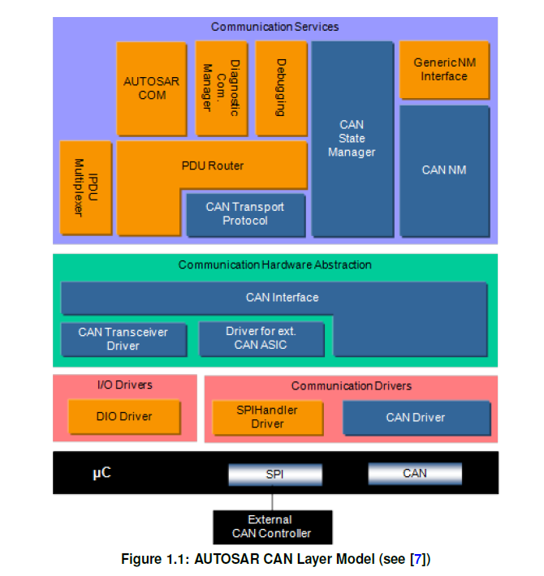

<section id="title">AUTOSAR CAN Interface</section>

# 简介和功能概述

本规范描述了AUTOSAR基础软件模块CAN接口（**CAN Interface**）的功能、API和配置。

如图1.1所示，CAN接口模块位于下层CAN设备驱动程序（CAN驱动程序[1]和收发器驱动程序 [2]）和上层通信服务层（即CAN状态管理器[3]、CAN网络管理[4]、CAN传输协议[5]、PDU路由器[6]）。 它提供上层通信层的CAN驱动程序服务的接口。

CAN接口模块提供了一个唯一的接口来管理不同的CAN硬件设备类型，例如：定义的 ECU 硬件布局使用的 CAN 控制器和 CAN 收发器。 因此，CAN 状态管理器模块可以基于物理 CAN 通道相关视图来控制多个底层内部和外部 CAN 控制器/CAN 收发器。

