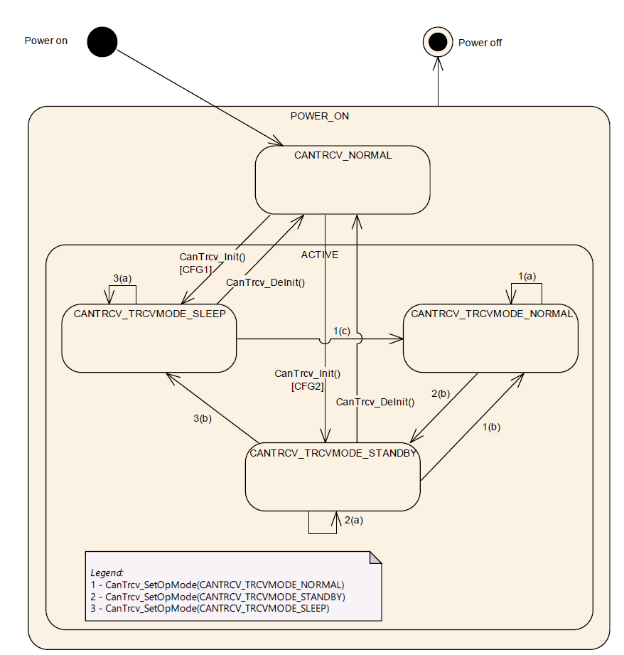

<section id="title">AUTOSAR CAN Transceiver Driver</section>

# 1. 介绍

本规范描述了CAN收发器驱动模块（**CAN Transceiver Driver**）的功能、API 和配置。CAN收发器驱动模块负责处理ECU上的CAN收发器硬件芯片。

CAN收发器是一种硬件设备，它将CAN总线上使用的信号电平调整为微控制器识别的逻辑（数字）信号电平。

此外，收发器能够检测电气故障，如接线问题、接地偏移或长显性信号的传输。根据与微控制器的接口，它们标记由单个端口引脚检测到的错误或由SPI检测到的详细错误的汇总。

一些收发器支持电源控制和通过CAN总线的唤醒。市场上通常有不同的唤醒/睡眠和电源概念。

在汽车环境中，主要使用三种不同的CAN总线物理特性。这些是用于高速CAN（高达：1Mbits/s）的**ISO11898**，用于低速 CAN（高达：125Kbits/s）的**ISO11519**，和用于单线CAN的**SAE J2411**。

最新发展包括SBC系统基础芯片（**System Basis Chips**），其中除了CA 之外还实现了电源控制和高级看门狗。它们封装在一个外壳中，并通过单一接口（例如通过 SPI）进行控制。

## 1.1. CAN收发器驱动程序的目标

AUTOSAR CAN收发器驱动程序的目标是为适用于大多数当前和未来CAN收发器设备定义接口和行为。CAN收发器驱动程序抽象了CAN收发器硬件。它为更高层提供了一个独立于硬件的接口。 它通过使用**MCAL**层的API来访问CAN收发器硬件，以便实现ECU布局中的抽象化。

## 1.2. 明确未覆盖的CAN收发器功能

一些CAN总线收发器提供附加功能，例如：用于诊断的ECU自检或者错误检测功能。**ECU**自检和错误检测并未在AUTOSAR标准中定义，AUTOSAR所需要实现的功能主要锁定在大多数当前使用的收发器硬件芯片。因此，也不支持接地偏移检测（**ground shift detection**）、选择性唤醒（**selective wake up**）、斜率控制模式（**slope control**）等功能。

同时AUTOSAR也不支持根据**SAE J2411**的单线CAN功能。

# 2. 缩略语

**ComM**         
    Communication Manager

**DEM**      
    Diagnostic Event Manager

**DET**
    Default Error Tracer 

**DIO**
    Digital Input Output (SPAL module)

**EB**
    外部缓冲通道。位于SPI处理程序/驱动程序之外，包含要传输的数据的缓冲区。

**EcuM**
    ECU State Manager
    
**IB**
    内部缓冲通道。位于 SPI 处理程序/驱动程序内部，包含要传输的数据的缓冲区。

**ISR**
    Interrupt Service Routine 中断服务程序 

**MCAL**
    Micro Controller Abstraction Layer 

**Port**
    Port module (SPAL module)

**SBC** 
    System Basis Chip 系统基础芯片。集成了例如 CAN 和/或 LIN 收发器、看门狗和电源控制。

**SPAL**         
    标准外设抽象 

**SPI Channel**
    一个通道是使用相同标准定义的软件数据交换介质。请参阅SPI驱动程序规范 
    
**SPI Job**
     一个作业由一个或多个具有相同片选的通道组成。作业被认为是原子的，因此不能被中断。 作业也具有指定的优先级。 有关详细信息，请参阅SPI驱动程序规范。

**SPI Sequence** 
    一个序列是要传输的多个连续作业。 序列取决于静态配置。 有关详细信息，请参阅 SPI 驱动程序规范。 

**CAN Channel**
     从 CAN 控制器通过 CAN 收发器连接到 CAN 网络的物理通道。 

# 3. 相关文档

## 3.1. 输入文件

[1] List of Basic Software Modules
> AUTOSAR_TR_BSWModuleList.pdf

[2] Layered Software Architecture
> AUTOSAR_EXP_LayeredSoftwareArchitecture.pdf

[3] Specification of ECU Configuration
> AUTOSAR_TPS_ECUConfiguration.pdf

[4] General Requirements on Basic Software
> AUTOSAR_SRS_BSWGeneral.pdf

[5] Specification of Specification of CAN Interface 
> AUTOSAR_SWS_CANInterface.pdf

[6] Basic Software Module Description Template
> AUTOSAR_TPS_BSWModuleDescriptionTemplate.pdf

[7] General Specification of Basic Software Modules
> AUTOSAR_SWS_BSWGeneral.pdf

## 3.2. 相关标准和规范

[8] ISO11898 – Road vehicles - Controller area network (CAN)

# 4. 约束和假设

## 4.1. 限制

CAN总线收发器硬件需要提供可映射到AUTOSAR CAN收发器驱动程序的操作模式模型的功能和接口。

# 5. 对其他模块的依赖

## 5.1. CanIf

所有CAN收发器驱动程序都在CanIf模块下。

## 5.2. ComM

**ComM**通过**CanIf**控制CAN收发器驱动程序通信模式。每个CAN收发器驱动程序都是独立控制的。

## 5.3. DET

**DET**从CAN收发器驱动程序（**CAN Transceiver Driver**）中获取开发错误信息。

## 5.4. DEM

**DEM**从CAN收发器驱动程序（**CAN Transceiver Driver**）中获取生产错误信息。

## 5.5. DIO

DIO模块用于通过端口连接访问CAN收发设备（**CAN transceiver device**）。

## 5.6. EcuM

**EcuM**通过**CanIf**从CAN收发器驱动程序（**CAN Transceiver Driver**）获取有关唤醒事件的信息。

# 6. 功能规格

## 6.1. CAN收发器驱动操作模式

CanTrcv模块需实现如下所示的状态图，并独立于每个配置的收发器。

此图的主要思想是通过使用通用方案，来支持众多的迄今为止可用的CAN总线收发器。根据CAN收发器硬件的不同，模型可能具有超出给定 CAN收发器硬件所需的一个或两个状态，但这显然会将**ComM**和**EcuM**与使用的硬件分离。

**1. POWER_ON**

> **ECU**已完全通电。

**2. NOT_ACTIVE**
> CAN收发器硬件的状态取决于ECU硬件以及**Dio**和**Port**驱动程序配置。CAN收发器驱动程序未初始化，因此未激活。

**3. ACTIVE**

> 函数**CanTrcv_Init**已被调用。CAN收发器驱动程序进入活动状态。根据配置，CAN收发器驱动程序进入状态**CANTRCV_TRCVMODE_SLEEP**或**CANTRCV_TRCVMODE_STANDBY**。

**4. CANTRCV_TRCVMODE_NORMAL**

> 总线处于全通信。如果CAN收发器硬件控制ECU电源，则ECU完全供电。CAN收发器驱动程序未检测到进一步的唤醒信息。

**5. CANTRCV_TRCVMODE_STANDBY**

> 可能无通信。如果CAN收发器硬件控制ECU电源，ECU仍然供电。 仅在此模式下，才能到**CANTRCV_TRCVMODE_SLEEP**的转换。可以通过总线或本地唤醒事件唤醒。

**6. CANTRCV_TRCVMODE_SLEEP**

> 可能无通信。ECU可能没有电源，依赖于谁复杂电源控制。可以通过总线或本地唤醒事件唤醒。

函数**CanTrcv_Init**会使收发器的状态更改为**CANTRCV_TRCVMODE_SLEEP**或**CANTRCV_TRCVMODE _STANDBY**。这取决于配置，并且可以为每个收发器独立配置。

如果一个CAN收发器驱动程序覆盖多个CAN收发器（配置为通道），则所有收发器（通道）要么处于 **NOT_ACTIVE**状态，要么处于**ACTIVE**状态。在状态**ACTIVE**中，每个收发器可能处于不同的子状态。

### 6.1.1. 操作模式切换

可以通过调用函数**CanTrcv_SetOpMode**请求模式切换。允许对当前模式的模式切换请求，并且即使启用了DET，也不应该导致错误。

对于每次调用 **CanTrcv_SetOpMode**的模式切换请求，在到达请求的模式后，CanTrcv模块需要使用**CanIf**的**TransceiverId**引用相应的CAN收发器，调用回调函数**CanIf_TrcvModeIndication**通知上层模块。

## 6.2. CAN收发器硬件操作模式

实际的CAN收发器硬件可能支持比上面状态图中显示的更多的模式转换。此章节会解释了这种依赖关系和推荐的实现行为。

决定CAN收发器硬件状态通过CAN收发器驱动程序哪个软件状态覆盖是由具体实现决定的。同时实现也必须确保所描述的CAN收发器驱动程序软件状态的全部功能会由实现达成。

### 6.2.1. 临时进入睡眠（Go-To-Sleep）模式的示例

通常称为进入睡眠（**Go-to-sleep**）的模式是从正常切换到睡眠时的临时模式。驱动程序将这种临时模式封装在CAN收发器驱动程序软件状态之一中。 此外，CAN 收发器驱动程序首先从正常切换到待机，然后通过额外的 API 调用从待机切换到睡眠。

### 6.2.2. PowerOn/ListenOnly模式示例

通常称为PowerOn或ListenOnly的模式是CAN收发器硬件只能接收消息但不能发送消息的模式。此外，在接收消息期间确认位的发送被抑制。此模式不被支持，因为它不属于CAN标准，并且并非所有CAN收发器硬件芯片都支持。

## 6.3. CAN收发器唤醒类型

有三种不同的场景通常被称为唤醒：

**场景一：**
1. MCU未通电。
2. 包括CAN收发器硬件在内的部分ECU已上电。
3. 所需考虑的CAN收发器处于**SLEEP**模式。
4. CAN收发器硬件检测到CAN总线上的唤醒事件。
5. CAN收发器硬件让MCU上电。

就AUTOSAR而言，这可以被认为是冷启动，而不是唤醒。

**场景二：**
1. MCU处于低功耗模式。
2. 包括CAN收发器硬件在内的部件ECU已上电。
3. 所关心的CAN收发器处于待机（**STANDBY**）模式。
4. CAN收发器硬件检测到CAN总线上的唤醒事件。
5. CAN 收发器硬件会触发唤醒的软件中断（**SW interrupt**）。
   
就AUTOSAR而言，这可以被认为是CAN通道和MCU的唤醒。

**场景三：**
1. MCU处于全功率模式。
2. 至少包括CAN收发器硬件在内的部分ECU已上电。
3. 所关心的CAN收发器处于待机（**STANDBY**）模式。
4. CAN收发器硬件检测到CAN总线上的唤醒事件。
5. CAN收发器硬件会使能唤醒事件的SW中断或者通过周期性轮询唤醒事件。
   
就AUTOSAR而言，这可以被认为CAN通道的唤醒。

## 6.4. 启用/禁用唤醒通知

CanTrcv驱动程序需要使用ICU驱动程序，提供的以下API来启用和禁用唤醒事件通知：

* **Icu_EnableNotification**
* **Icu_DisableNotification**
  
只有配置了参数**CanTrcvIcuChannelRef**，CanTrcv驱动程序才能启用/禁用ICU通道。

CanTrcv驱动程序需注意以下内容以避免唤醒事件的丢失：
* 当收发器转换到待机模式（**CANTRCV_STANDBY**）时，它需要启用ICU通道。
* 当收发器转换到正常模式 (**CANTRCV_NORMAL**) 时，它需要禁用ICU通道。

## 6.5. CAN收发器唤醒模式

CAN收发器驱动程序提供两种唤醒模式：

**NOT_SUPPORTED模式**

在**NOT_SUPPORTED**模式下，CAN收发器驱动程序不会产生唤醒。 所有CAN收发器硬件类型都支持此模式。

**POLLING模式**

在**POLLING**模式下，CAN收发器驱动程序产生的唤醒可能会导致CAN通道唤醒。在此模式下，无法唤醒MCU。该模式由需依赖使用的CAN收发器硬件类型。 **POLLING**唤醒模式会在函数**CanTrcv_CheckWakeup**和主函数**CanTrcv_MainFunction**中支持实现。

主函数**CanTrcv_MainFunction**由BSW调度程序调用，**CanTrcv_CheckWakeup**由**CanIf**模块调用。

唤醒模式的选择由配置参数**CanTrcvWakeUpSupport**实现。可以通过配置参数**CanTrcvWakeupByBusUsed**为每个单独CAN收发器的唤醒设置打开和关闭的支持。

注意：在这两种唤醒模式下，功能**CanTrcv_CheckWakeup**都需要存在，但功能应基于配置的唤醒模式（**NOT_SUPPORTED**或**POLLING**）。

在检测到唤醒后，如果CAN收发器需要由软件启动特定状态转换（例如：睡眠->正常），这可以由CanTrcv模块在执行**CanTrcv_CheckWakeup**期间完成，此行为是特定于实现的。

当收发器需要特定的状态转换时，必须通过配置这些涉及唤醒过程模块（EcuM、CanIf、ICU 等）来确保**CanTrcv_CheckWakeup**被调用。