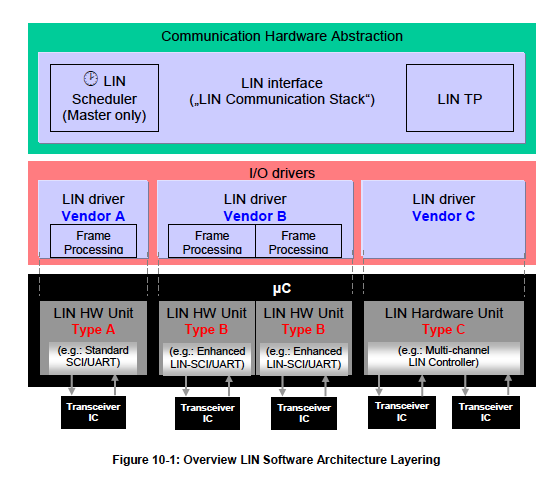

<section id="title">AUTOSAR LIN Driver</section>

# 1. 简介和功能概述

本文介绍了AUTOSAR基础软件模块LIN驱动程序的功能、API和配置。

本文的基础是**ISO 17987**规范[16]。本文并不会再次描述**ISO 17987**规范中已有的LIN功能，而只会对AUTOSAR相关内容进行介绍。

LIN驱动适用于**ISO 17987**规范中主节点（**master node**）和从节点（**slave node**）。AUTOSAR中的LIN实现可能与ISO 17987规范中描述的LIN驱动程序有偏差，但LIN总线上的行为不会发生变化。它的目的是能够让所有现有的LIN节点以在AUTOSAR LIN实现(即LIN驱动程序)能被重用。

LIN驱动模块的目的是支持从简单的SCI/UART到复杂LIN硬件控制器（**LIN hardware controller**）的全部LIN硬件。SW-UART不在此模块定义的范畴。

## 1.1. 体系结构概述

LIN驱动模块属于微控制器抽象层（**MCAL**）的一部分，它主要实现了执行硬件访问，并为上层模块提供一个硬件独立的API。唯一能够访问LIN驱动程序的上层是LIN接口（LINIf）模块。

LIN驱动模块可以支持多个通道。这意味着LIN驱动模块可以处理一个或多个LIN通道，只要它们属于同一个LIN硬件单元。

在下面的例子中，三个不同的LIN驱动程序被连接到一个LIN接口（**LIN interface**）。然而单个LIN驱动是最常见的配置。

# 2. 缩略语和术语表

## 2.1. 缩略语

| 缩略语 | 说明                                                                   |
| ------ | ---------------------------------------------------------------------- |
| ISR    | Interrupt Service Routine                                              |
| LIN    | Local Interconnect Network                                             |
| MCAL   | MicroController Abstraction Layer                                      |
| PDU    | Protocol Data Unit. Consists of Identifier, data length and Data (SDU) |
| PID    | Protected ID                                                           |
| PLL    | Phase-Locked Loop                                                      |
| RX     | Reception                                                              |
| SCI    | Serial Communication Interface                                         |
| SDU    | Service Data Unit. Data that is transported inside the PDU             |
| SFR    | Special Function Register                                              |
| SPAL   | Standard Peripheral Abstraction Layer                                  |
| TP     | Transport Layer                                                        |
| TX     | Transmission                                                           |
| UART   | Universal Asynchronous Receiver Transmitter                            |

## 2.2. 术语表

|术语|说明|
|--|--|
|LIN channel|The LIN channel entity interlinks the ECUs of a LIN cluster physically: An ECU is part of a LIN cluster if it contains one LIN controller that is connected to one LIN channel of the LIN cluster. An ECU is allowed to connect to a particular LIN cluster through one channel only.|
|LIN cluster|A cluster is the LIN bus wire plus all the nodes。|
|LIN controller|A dedicated LIN hardware with a build Frame processing state machine. A hardware which is capable to connect to several LIN clusters is treated as several LIN controllers.|
|LIN frame | All information is sent packed as frames; a frame consist of the header and a response. |
|LIN frame processor | Frame processing implies the complete LIN frame handling. Implementation could be achieved as software emulated solution or with a dedicated LIN controller. |
|LIN hardware unit | A LIN hardware unit may drive one or multiple LIN channels to control one or multiple LIN clusters.|
|LIN header | A header is the first part of a frame; it is always sent by the master.|
|LIN node| Loosely speaking, a node is an ECU. However, a single ECU may be connected to multiple LIN clusters.|
|LIN response|A LIN frame consists of a header and a response. Also called a Frame response.|

## LIN硬件单元分类

片载的LIN硬件单元由一个或几个LIN通道组成。

下图是连接到多个LIN物理通道的不同LIN硬件类型的分类:

