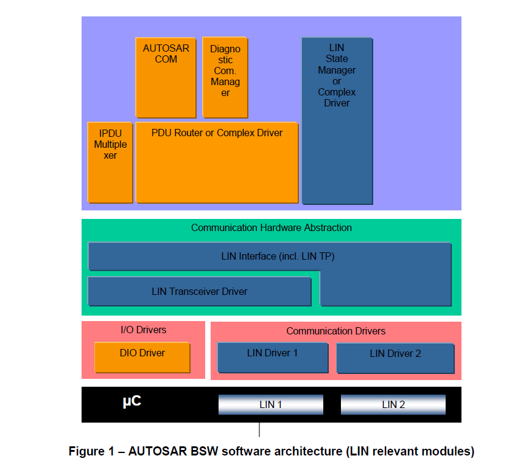

<section id="title">AUTOSAR LinIf (LIN Interface)<section>

# 1. 简介和功能概述

本文介绍了AUTOSAR基本软件模块LIN接口（**LinIf**）和LIN传输协议（**LinTp**）的功能、API和配置。其中LIN TP属于LIN接口的一部分。

唤醒功能包含在LIN接口（**LIN Interface**），LIN驱动（**LIN Driver**）和LIN收发器驱动（**LIN Transceiver Driver**）中。

本文档基于ISO 17987规范[19]，同时文档将不会再次描述**ISO 17987**中的LIN功能。

LIN接口模块适用于ISO 17987主节点（**master node**）和从节点（**slave node**），兼容LIN 2.2和LIN 2.1主节点。AUTOSAR中的LIN实现可能和ISO 17987规范有部分出入，但LIN总线上的行为不会发生变化。它的目的是能够让所有现有的LIN节点在AUTOSAR LIN上重用。

LIN接口被设计成硬件独立的。并明确定义了于上层模块（**PDU Router**）和下层模块（**LIN Driver**）模块之间的接口定义。

LIN接口可以处理多个LIN驱动程序。LIN驱动可以支持多个通道。这意味着LIN驱动程序可以处理一个或多个LIN通道。

## 1.1. 体系结构概述

根据分层软件体系结构[2]，LIN接口位于基础软件体系结构中，如图1所示。本例中，LIN接口连接到两个LIN驱动程序。然而单个的LIN驱动程序是最常见的配置。

## 1.2. 功能概述

LIN接口模块负责实现**ISO 17987**中定义的LIN功能。包含以下功能:
* 执行ECU连接到的每个LIN总线当前选择的调度表（**schedule**）。
* 作为一个主节点，发送报头，并且发送和接收响应。
* 按上层模块的请求，切换主节点的调度表。
* 接受来自上层模块的帧发送请求，并在适当的LIN帧内发送数据作为响应。
* 在适当的帧内收到相应的响应时，为上层提供帧接收通知。
* 睡眠和唤醒服务。
* 错误处理。
* 诊断传输层服务。
* 从节点配置和识别服务。

# 2. 首字母缩写词和缩写词

# 3. 相关的文档

# 4. 约束和假设

# 5. 对其他模块的依赖关系

# 6. 功能规范

本章节不会对**ISO 17987**规范[19]中已经规定的要求再做额外的说明。只会关注在AUTOSAR中的没有被充分指定或缺失的特定细节。

LIN接口应该支持**ISO 17987**规范中定义的主从行为。上述也就是意味着来自ISO 17987节点和LIN接口节点的通信是相等的。LIN接口应该实现LIN行为，能确保现有的LIN节点可以被重用。

LIN接口应该能够处理一个或多个LIN通道。

## 6.1. 帧传输

LIN接口能支持**ISO 17987**规范中定义的以下帧类型:

* 无条件帧（**Unconditional frame**）
* 事件触发帧（**Event-triggered frame**）
* 零星帧（**Sporadic frame**）
* 诊断帧MRF和SRF（**Diagnostic frames MRF and SRF**）
* 保留帧（**Reserved frames**）

### 6.1.1. 无条件帧的传输

这是LIN集群中使用的普通帧类型。它在总线上的传输严格按照调度表进行。

### 6.1.2. 事件触发帧的传输

事件触发帧用于从节点的偶发传输。这种类型的帧通常用于非时间关键函数中。根据实现的节点类型，主节点和从节点的需求是不同的。

#### 6.1.2.1. 主节点中的事件触发帧的传输

由于多个从节点可能会响应一个同一个事件触发的帧报头，所以可能会发生冲突。发送的从节点需要检测到这冲突并退出通信。

如果在事件触发的帧响应中发生冲突，则LIN接口将切换到相应的冲突解决调度表。当检测到冲突后，LIN接口将在当前帧间隙（**Frame Slot**）的末尾切换到给定的冲突解决调度表。冲突解决调度表由LIN接口配置参数**LinIfCollisionResolvingRef**定义给出。

#### 6.1.2.2. 从节点中的事件触发帧的传输

上层模块决定了事件触发帧响应何时传输。因此，相关API调用可以用来设置事件触发的帧响应等待（**response pending**）传输。LIN接口应该保持一个标志来保持每个事件触发帧响应的传输状态。分配给事件触发帧的无条件帧响应的第一个数据字节需要被保留给无条件帧的PID。

如果接收到事件触发帧的报头，并处于响应等待的状态，LIN接口将在响应数据的第一个字节发送无条件帧的PID。无条件帧响应的有效载荷将保存在响应数据的紧接着的字节内容中传输。事件触发帧响应一旦成功传输，LIN接口将清除该帧响应的挂起标志。这也适用于响应作为无条件帧成功传输的情况。

### 6.1.3. 零星帧的传输（只支持主节点）

零星帧仅适用于LIN的主节点。对于LIN的从节点来说，接收到的零星帧与接收到的无条件帧没有区别。

**ISO 17987**规范定义了零星帧。在这里需要对零星帧进行更精确的定义：

* 零星槽（**Sporadic slot**） : 零星帧的占位符。将它命名为**slot**的原因是它没有LIN帧ID。
* 零星帧（**Sporadic frame**）: 附加在零星槽上的无条件帧。

只有主节点允许发送零星帧。只有零星帧应才能分配到零星槽中。上层模块决定了零星帧的传输。因此必须提供API来设置零星帧的传输等待。LIN接口应对特定传输的零星帧进行标记。

LIN接口需要根据零星帧的优先级在相关的零星槽中传输特定的零星帧。零星帧的优先级是这些零星帧在LDF中被列出的顺序，不适用LDF的优先级机制。分配给同一个调度槽的零星帧的优先级由配置参数**LinIfFramePriority**定义。

### 6.1.4. 诊断框架MRF和SRF的传输

MRF（**Master Request Frame**）和SRF（**Slave Response Frame**）是用于传输**ISO 17987**节点配置服务（**node configuration services**）和TP消息（TP messages）的固定ID的帧。

#### 6.1.4.1. 诊断框架MRF和SRF的传输（只支持主节点）

如果TP传输正在进行时LIN接口可以发送MRF。当调度表条目到期，数据会被发送。

**注意：**
节点配置机制也使用MRF，但上述需求只在调度表中遇到MRF时适用。节点配置应使用特殊调度条目。

对于从节点的响应帧，主节点只需发送报文头。通常情况，因为主节点不知道从节点在帧的响应部分是否有数据要发送，所以响应帧总是会被发送。唯一例外的情况是，主节点因为没有缓冲区来存储数据，所以希望在TP帧序列期间防止接收这样的响应帧。

当调度表条目到期时，LIN接口需要发送SRF报头。当TP层表示上层模块暂时无法提供接收缓冲区时，需要停止发送SRF报头。

### 6.1.5. 保留帧的传输

参照ISO 17987规范，LIN接口模块不支持保留帧的传输。

## 6.2. 帧接收

### 6.2.1. 主节点的帧接收

LIN主节点负责调度表的调度，启动总线上的所有帧。

以下的内容适用于被主节点调度并等待运输的所有接收到的帧类型。

#### 6.2.1.1. 报头

当一个新的帧接收调度表条目到期时，LIN接口应该调用LIN驱动模块（**LIN Driver**）的**Lin_SendFrame**函数。

#### 响应

在报头发送后，LIN驱动程序将自动设置为接收状态。

#### 状态检查

LIN接口应该在最大帧长度之后最早调用Lin_GetStatus函数，在下一个schedule entry到期时最晚调用Lin_GetStatus函数来确定LIN Driver模块的状态。

