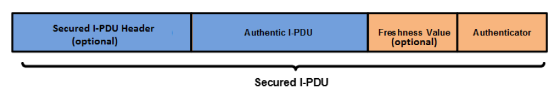
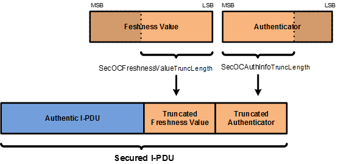

**AUTOSAR SecOC ()**

# 1. 简介和功能概述

本文介绍了AUTOSAR安全板载通信模块（**SecOC**）软件规范。它描述了AUTOSAR SecOC模块的基本安全特性、功能和API。

**SecOC**模块旨在为PDU级别的关键数据提供资源高效和可行的认证机制。认证机制应该与当前的AUTOSAR通信系统无缝集成。对资源消耗的影响应该尽可能小，以便将保护作为遗留系统的附加组件。该规范基于这样一个假设，主要使用对称的身份（**symmetric authentication approach**）验证方法和消息身份验证码（**message authentication codes**）。它们用比非对称方法小得多的密钥实现了相同的安全级别，并且可以在软件和硬件中紧凑而高效地实现。同时本规范提供了必要的抽象级别，因此对称方法（**symmetric approaches**）和非对称身份验证（**asymmetric authentication approaches**）方法都是可以使用。

**SecOC**模块集成在**AUTOSAR PduR**级别。图中显示了**SecOC**模块集成为Autosar通信堆栈的一部分。

在该配置中，**PduR**负责将进出安全相关的**I-PDU**路由到**SecOC**模块。然后**SecOC**模块添加或处理安全相关信息，并将结果以**I-PDU**的形式传播回**PduR**。PduR负责进一步路由**I-PDU**。此外**SecOC**模块利用**CSM**提供的加密服务与**Rte**交互以允许密钥（**Key**）和计数器（**Counter**）管理。**SecOC**模块需要支持**PduR**支持的各种通信模式和原则，特别是组播通信（**Multicast communications**）、传输协议（**Transport Protocols**）和PduR网关（**PduR Gateway**）。

# 2. 首字母缩写词和缩写词

| Abbreviation / Acronym | Description                        |                  |
| ---------------------- | ---------------------------------- | ---------------- |
| CSM                    | The AUTOSAR Crypto Service Manager | 加密服务管理模块 |
| SecOC                  | Secure Onboard Communication       | 安全板载通信     |
| MAC                    | Message Authentication Code        | 消息身份验证代码 |
| FV                     | Freshness Value                    | 新鲜度值         |
| FM                     | Freshness Manager                  | 新鲜度管理器     |

# 3. 约束和假设

## 3.1. 对汽车领域的适用性

SecOC模块用于所有需要安全通信的ECU。SecOC模块还没有被指定与**MOST**和**LIN**通信网络一起工作。由于**MOST**没有得到特别的支持，它对多媒体和车载通信领域的适用性可能会受到限制。

## 3.2. SomeIpTp约束

**SecOC**模块只能用于保护整个**SomeIpTp**消息，不能用于保护某个**SomeIpTp**消息的单个片段。

在数据传输时以下模块顺序是被允许:
**SecOC -> PduR -> SomeIpTp**

但以下模块顺序是不被允许的:
**SomeIpTp -> PduR -> SecOC**

**SecOC**不能用来保护**SomeIpTp**单个消息段的主要原因如下: 
>  **SomeIpTp**需要调用**SomeIpTp_TriggerTransmit**来创建**SomIpTp**头。**SecOC**不支持上层通过**TriggerTransmit**方式提供数据。

# 4. 对其他模块的依赖关系

## 4.1. PduR

**SecOC**模块依赖于**PduR**的API和功能。提供了**PDU Router**所需的上下两层API（**upper and lower layer API**）功能，即:
* 通信接口（**Communication Interface**）模块的API。
* 传输协议（**Transport Protocol**）模块的API。
* 使用传输协议（**Transport Protocol**）模块的上层模块的API。
* 处理通信接口（**Communication Interface**）模块发出的I-PDU的上层模块的API。

为了将安全处理的结果提供给**PduR**, **SecOC**模块需要**PduR**相关的API功能。

## 4.2. CSM

**SecOC**模块依赖于由**CSM**模块在AUTOSAR中提供的加密算法。**SecOC**模块需要API函数来生成和验证加密签名（**Cryptographic Signatures**）或消息验证码（**Message Authentication Codes**），即
* MAC生成接口（**Csm_MacGenerate**）。
* MAC验证接口（**Csm_MacVerify**）。
* 签名生成接口（**Csm_SignatureGenerate**）。
* 签名验证接口（**Csm_SignatureVerify**）。

## 4.3. RTE

SecOC模块提供了具有管理功能的API。这个API包含以下作为服务接口提供给RTE调用。
* **SecOC_VerificationStatus**
* **SecOC_VerifyStatusOverride**
* **SecOC_VerificationStatusIndication**

**Rte**包括**BSW-Scheduler**。**SecOC**模块依赖于**BSW-scheduler**在**SecOCMainFunctionPeriodRx**和**SecOCMainFunctionPeriodTx**中周期配置来调用函数**SecOC_MainFunctionRx**和**SecOC_MainFunctionTx**函数。

# 5. 功能规范

为了保护车辆系统的正确和安全功能，敏感数据的认证和完整性保护是必要的，这可以确保接收到的数据来自正确的ECU，具有正确的值。

**SecOC**模块的目标是在**PDU**级别上实现资源高效和实用的敏感数据认证机制。规范中提出的方法通常支持使用对称和非对称方法来保护真实性和完整性。这两种方法的目标大致相同，在概念上有很大的相似之处，但由于底层基元的技术属性不同，也存在一些差异。此外常用的身份验证器的术语是不同的。通常术语消息验证码（**Message Authentication Code, MAC**）用于对称方法，而术语签名或数字签名（**signature or digital signature**）指的是具有不同属性和约束的非对称方法。

## 5.1. 安全解决方案规格说明

本文中描述的SecOC模块提供了必要的功能，用于验证整车架构中ECU之间基于PDU的通信的真实性（**authenticity**）和新鲜度（**freshness**）。该方法需要发送的ECU和接收的ECU都实现**SecOC**模块。集成了的两个**SecOC**模块，提供发送端和接收端上、下两层**PduR**接口。两边的**SecOC**模块通常与**PduR**模块交互。

为了提供消息的新鲜度，发送和接收端的**SecOC**模块为每个唯一可识别的安全I-PDU（即每个安全通信链路），从外部的freshness Manager获取新鲜度。

在发送端，**SecOC**模块通过在发出的可信**I-PDU**上添加认证信息，创建一个安全的**I-PDU**。验证信息包括验证器（例如：消息验证码MAC）和可选的新鲜度值（**Freshness Value**）。无论在安全**I-PDU**负载中是否包含新鲜度值，在生成验证器时都需要考虑新鲜度值。当使用新鲜度计数器而不是时间戳时，在向接收方提供认证信息之前，新鲜度管理器需要对新鲜度计数器增1。

在接收端，**SecOC**模块通过验证发送端**SecOC**模块附加的认证信息来检测可信**I-PDU**的新鲜度和真实性。为了验证真实的**I-PDU**的真实性和新鲜度，提供给接收方的安全**I-PDU**应该与发送方的安全**I-PDU**相同，接收方的安全**I-PDU**应该知道发送方在创建验证器时使用的新鲜度值。

SecOC模块的主要目的是实现本规范中描述的安全功能。

### 5.1.1. 安全解决方案的基本实体

#### 5.1.1.1. 可信I-PDU和安全I-PDU

可信I-PDU（**Authentic I-PDU**）指的是需要保护的AUTOSAR I-PDU，以防止未经授权的操作和重放攻击。

安全I-PDU（**Secured I-PDU**）的负载由可信I-PDU（**Authentic I-PDU**）和验证器（如：**消息验证码MAC**）组成。安全I-PDU的有效负载可以选择地是否包含新鲜度值来用于创建验证器（如：MAC）的。安全I-PDU中内容的结构顺序符合如图。

在安全的**I-PDU**中，可信的**I-PDU**的长度、新鲜度值和验证器可能会因为安全I-PDU唯一不确定性而不同。

验证器（**Authenticator**）是指通过使用密钥（**Key**）、安全I-PDU的数据标识符（**Data Identifier**）、可信负载（**Authentic Payload**）和新鲜度值（**Freshness Value**）而生成的唯一认证数据字符串。验证器提供了一个高度的可信度，即可信I-PDU中的数据是由合法源生成的，并在其预期的时间提供给接收ECU。

根据用于生成验证器的认证算法（参数：**SecOCTxAuthServiceConfigRef**或**SecOCRxAuthServiceConfigRef**），可能会截断由验证算法生成的最终结果（例如，在MAC的情况下）。当消息有效负载的长度受到限制并且没有足够的空间包含完整的验证器（**Authenticator**）时，可能需要截断。

安全认证I-PDU中包含的验证器长度（参数：**SecOCAuthInfoTruncLength**）与唯一可识别的安全认证I-PDU相关。通过提供每个安全I-PDU的MAC截断长度的细粒度配置，可以在整个系统中提供灵活性（例如：两个独立的、唯一的安全I-PDU的负载中可能包含不同的验证器长度）。

如果截断是可能的，验证器应该只被截断到由验证算法生成的结果验证器的最重要的位。下图显示了基于参数**SecOCFreshnessValueTruncLength**和**SecOCAuthInfoTruncLength**的验证器和新鲜度值的截断示例。

**注意**：
对于静态参与者嵌入的资源约束用例，我们建议使用消息认证码（**Message Authentication Codes**）作为认证的基础。（例如：基于AES的CMAC，具有足够的密钥长度）。

在使用MAC的情况下，可以只传输和比较部分MAC，这被称为MAC截断。然而这导致了较低的安全级别，至少能对单个MAC的伪造。虽然我们建议始终使用至少128位的密钥长度，但MAC截断可能是有益的。当然每个用例的MAC的实际长度必须谨慎选择。一般认为，64位及以上的MAC大小可以提供足够的保护，防止NIST的猜测攻击。根据用例，不同的MAC大小可能是合适的，但这需要安全专家的仔细判断。

#### 5.1.1.2. 验证者涵盖的数据

验证器（Authenticator）计算的数据由安全I-PDU的数据标识符（参数：**SecOCDataId**）、可信I-PDU数据和完整的新鲜值（**Complete Freshness Value**）组成。它们分别连接在一起，组成传递到身份验证器生成/验证的身份验证算法的bit array里。

DataToAuthenticator = 数据标识符（**Data Identifier**） | 可信I-PDU的安全部分 （**secured part of the Authentic I-PDU**）| 完整的新鲜值（**Complete Freshness Value**）

**注意:**:
" | "表示连接。

#### 5.1.1.3. 新鲜度值

每个安全I-PDU至少配置一个新鲜度值（**Freshness Value**）。新鲜度值是一种单调计数器，用于保证保护I-PDU的新鲜度。这种单调计数器可以通过称为新鲜度计数器（**Freshness Counter**）的单个消息计数器来实现，也可以通过称为新鲜度时间戳（**Freshness Timestamp**）的时间戳值来实现。新鲜度值来自于一个新鲜度管理器（**Freshness Manager**）。

