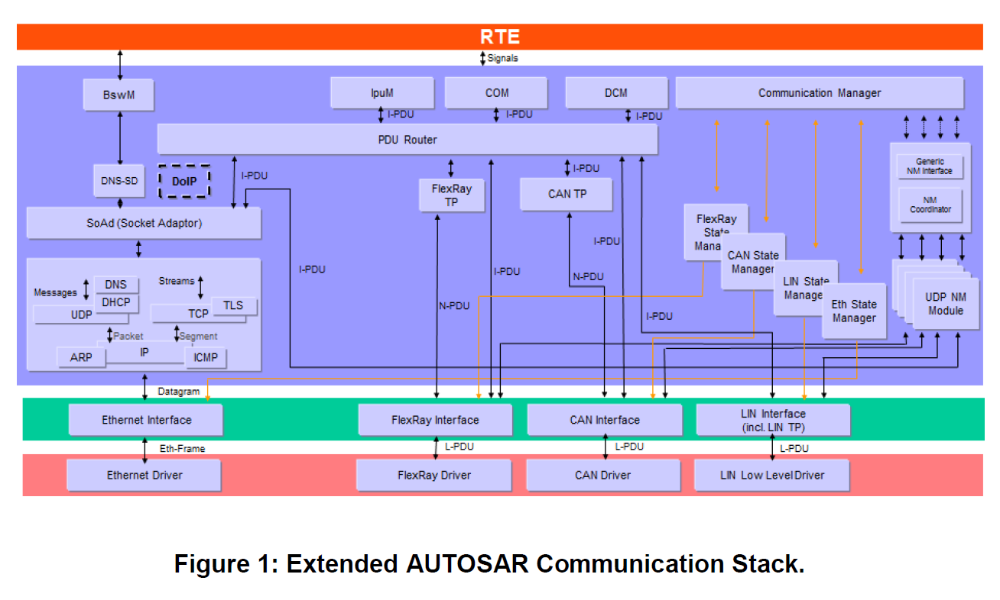
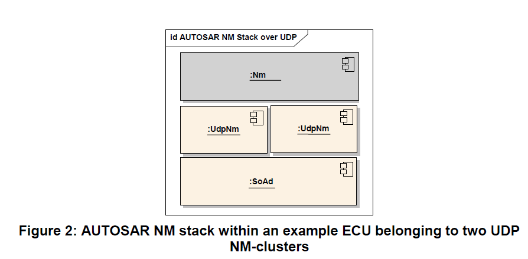
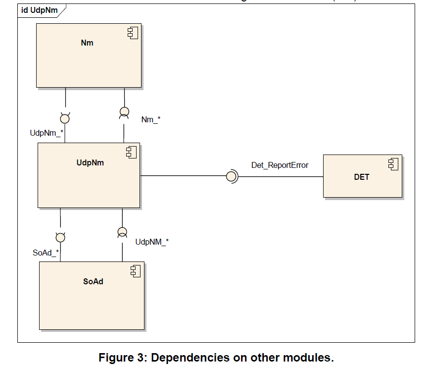
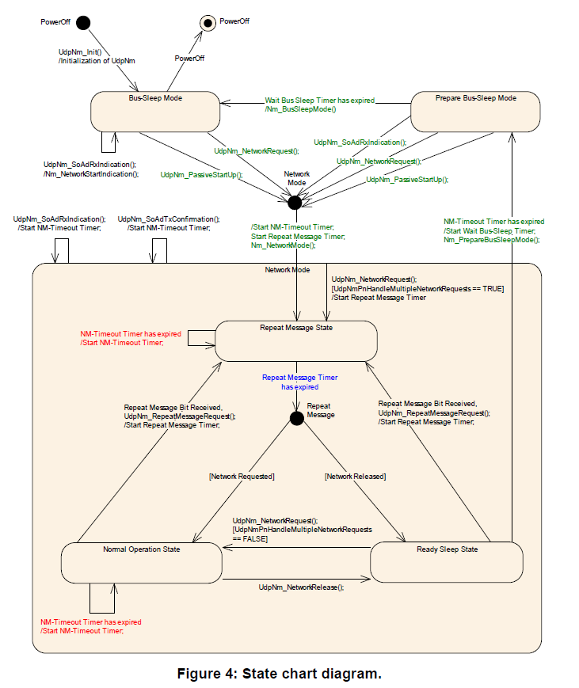

<section id="title">AUTOSAR UdpNm (UDP Network Management)</section>

# 1. 简介和功能概述

本文档描述了**AUTOSAR UDP**网络管理（**UdpNm**）的概念、核心功能、可选特性、接口和配置问题。 **UdpNm**主要设计成一个可选功能, 旨在与**TCP/IP**堆栈一起工作，独立于所使用的通信系统的物理层。**AUTOSAR UDP**网络管理是一个独立于硬件的协议，可用于基于**TCP/IP**的系统。其主要目的是协调网络正常运行和总线睡眠模式之间的转换。

除了核心功能之外，它还提供了一些可选功能，例如：实现一个服务来检测所有当前节点或检测所有其他节点是否准备好休眠。

UDP 网络管理（**UdpNm**）功能提供网络管理接口（**Nm**）和**TCP/IP**堆栈之间的适配。 有关AUTOSAR网络管理功能的一般理解，请参阅[9]。

# 2. 缩略语

## 2.1. 缩略语

| 缩略语 | 具体描述       |
| ------ | -------------- |
| CWU    | 车辆唤醒       |
| EthIf  | 以太网接口     |
| IP     | 互联网协议     |
| NM     | 网络管理       |
| PDU    | 协议数据单元   |
| PNL    | 部分网络学习   |
| SDU    | 服务数据单元   |
| TCP    | 传输控制协议   |
| UDP    | 用户数据报协议 |
| PNI    | 部分网络信息   |
| UdpNm  | UDP网络管理    |

## 2.2. 术语 

* PDU传输能力被禁用（**PDU transmission ability is disabled**）
  > 这意味着**NM**消息传输已被可选服务**UdpNm_DisableCommunication**禁用。
* 重复消息请求位指示（**Repeat Message Request Bit Indication**）
  > 在接收到的**NM**消息时，**UdpNm_SoAdIfRxIndication**函数寻找**Control Bit Vector**的重复消息位。
* **NM PDU** 
  > 指在数据包中传输的有效载荷。 它包含**NM**用户数据以及控制位向量和源节点标识符。
* **NM Packet**
  > 指一个以太网帧，除了由NM在有效载荷部分传输的数据（**PDU**）之外，还包含一个**IP**和一个**UDP**报头。
* NM Message
  > 抽象术语，指在NM算法的方法中传输的任何单个信息项。
* **Bus-Off state**
  > 指没有电缆连接到以太网硬件的情况。
* 顶级PNC协调员（**Top-level PNC coordinator**）
  > 顶级PNC协调器是一个ECU，它充当网络中的PNC网关，并在所有分配的通道上主动协调处理至少一个PNC。如果启用了同步PNC关闭，如果网络中没有其他ECU请求它们，顶级PNC协调器将为这些PNC触发关闭。
* 中间PNC协调器（**Intermediate PNC coordinator**）
  > 中间PNC协调器是一个ECU，它充当网络中的PNC网关，并在至少一个分配的通道上将至少一个PNC处理为被动协调。如果启用了同步PNC关闭，它会将收到的这些PNC的关闭请求转发到相应的主动协调通道，并相应地启动它们的关闭。
* PNC叶节点（**PNC leaf node**）
  > PNC叶节点是一个ECU，在网络中根本不充当PNC协调器。它像通常的NM消息一样处理PN关闭消息。
* PN关闭消息（**PN shutdown message**）
  > 顶级PNC协调器发送PN关闭消息以指示跨PN拓扑的同步PNC关闭。PN关闭消息是作为**NM**消息，它在控制位向量中具有**PNSR**位，并且所有被指示用于同步关闭的PNC都设置为**1**。

  # 3. 相关文档

  ## 3.1. 输入文件

[1] Layered Software Architecture 
> AUTOSAR_EXP_LayeredSoftwareArchitecture.pdf

[2] General Requirements on Basic Software Modules 
> AUTOSAR_SRS_BSWGeneral.pdf

[3] Requirements on Network Management 
> AUTOSAR_SRS_NetworkManagement.pdf

[4] Specification of Ethernet Interface 
> AUTOSAR_SWS_EthernetInterface.pdf

[5] Specification of FlexRay Network Management
> AUTOSAR_SWS_FlexRayNetworkManagement.pdf

[6] Specification of Communication Stack Types
> AUTOSAR_SWS_CommunicationStackTypes.pdf

[7] Specification of ECU Configuration
> AUTOSAR_TPS_ECUConfiguration.pdf

[8] Specification of BSW Scheduler 
> AUTOSAR_SWS_BSW_Scheduler.pdf

[9] Specification of Generic Network Management Interface
> AUTOSAR_SWS_NetworkManagementInterface.pdf

[10] Specification of Communication Manager
> AUTOSAR_SWS_ComManager.pdf

[11] Specification of ECU State Manager 
> AUTOSAR_SWS_ECUStateManager.pdf

[12] Specification of Operating System 
> AUTOSAR_SWS_OS.pdf

[13] Specification of Default Error Tracer 
> AUTOSAR_SWS_Default ErrorTracer.pdf

[14] Specification of Standard Types 
> AUTOSAR_SWS_StandardTypes.pdf

[15] Specification of Platform Types 
> AUTOSAR_SWS_PlatformTypes.pdf

[16] Specification of Compiler Abstraction 
> AUTOSAR_SWS_CompilerAbstraction.pdf

[17] Basic Software Module Description Template
> AUTOSAR_TPS_BSWModuleDescriptionTemplate.pdf

[18] Specification of Socket Adaptor 
> AUTOSAR_SWS_SocketAdaptor.pdf

[19] Requirements on Ethernet 
> AUTOSAR_SRS_Ethernet.pdf

[20] List of Basic Software Modules 
> AUTOSAR_TR_BSWModuleList.pdf

[21] General Specification of Basic Software Modules
> AUTOSAR_SWS_BSWGeneral.pdf

[22] Specification of the AUTOSAR Network Management Protocol 
> AUTOSAR_PRS_NetworkManagementProtocol.pdf

[23] Specification of SystemTemplate 
> AUTOSAR_TPS_SystemTemplate.pdf

## 3.2. 相关标准和规范

[24] IEEE 
> http://www.opengroup.org/onlinepubs/000095399/

[25] ISO 14229 Road Vehicles – Unified Diagnostic Services (UDS)

## 3.3. 相关规范

AUTOSAR提供了基础软件模块的通用规范[21]（**SWS BSW General**），它也适用于UDP网络管理。

因此，规范**SWS BSW General**应被视为UDP网络管理的附加和必需规范。

# 4. 约束和假设

## 4.1. 限制

1. 一个**UdpNm**实例只与一个网络中的一个NM集群（**NM-Cluster**）相关联。 一个NM集群在一个节点中只能有一个**UdpNm**实例。
2. **UdpNm**的一个实例仅与同一ECU内的一个网络相关联。
3. **UdpNm**仅适用于基于**TCP/IP**的系统。

下图展示了属于两个UDP NM集群的示例ECU内的AUTOSAR NM堆栈。

默认情况下AUTOSAR UdpNm算法应支持每个NM集群包含最多250个节点。

**注意**：AUTOSAR UdpNm算法可以支持每个NM集群任意数量的节点（如果需要：甚至超过每个集群默认250个节点的限制）。这只是配置问题，上限不是固定的，取决于为AUTOSAR UdpNm协调算法配置的响应时间、容错性和结果总线负载之间的权衡。 这可能取决于所使用的物理层。

# 5. 对其他模块的依赖

UDP网络管理（**UdpNm**）使用**TCP/IP**堆栈的服务，并向通用网络管理接口（**Nm**）提供服务。

# 6. 功能规格

## 6.1. 协调算法

**AUTOSAR UdpNm**基于去中心化（**decentralized**）的直接网络管理策略，这意味着每个网络节点仅根据通信系统内接收和/或传输的UD 数据包，执行自给自足的活动。

AUTOSAR UdpNm协调算法基于周期性的NM数据包（**Nm Packet**），通过广播传输被集群中的所有节点所接收。接收到NM数据包表明发送节点希望保持NM集群处于唤醒状态。如果任何节点准备好进入总线睡眠模式（**Bus-Sleep Mode**），它就会停止发送NM数据包。但只要收到来自其他节点的NM数据包，它就会推迟转换到总线睡眠模式。最后如果由于不再接收到NM数据包，而导致专用计时器超时，则每个节点都会启动到总线睡眠模式的转换。

如果NM集群（**NM-cluster**）中的任何节点需要总线通信，它可以通过发送NM数据包来保持 NM集群唤醒状态。有关唤醒过程本身的更多详细信息，可参阅[10]。

AUTOSAR UdpNm协调算法的主要概念，可以通过以下两个关键需求定义：
1. 只要需要总线通信，每个网络节点都应发送周期性的NM PDU。否则节点就不应发送NM PDU。
2. 如果**UdpNmStayInPbsEnabled**被禁用，UdpNm集群中的总线通信被释放，同时通过配置参数**UdpNmTimeoutTime** + **UdpNmWaitBusSleepTime**确定的可配置时间量内，总线上没有网络管理PDU，则节点应执行转换到总线睡眠模式。

从NM集群中单个节点的角度来看，AUTOSAR UdpNm状态机应包含AUTOSAR UdpNm协调算法所需的状态（**state**）、转换（**transition**）和触发（**trigger**）。

## 6.2. 操作模式

**AUTOSAR UdpNm**应包含以下的三种操作模式：
1. 网络模式（**Network Mode**）
2. 准备总线睡眠模式（**Prepare Bus-Sleep Mode**）
3. 总线睡眠模式（**Bus-Sleep Mode**）

**AUTOSAR UdpNm**操作模式的变化需要通过回调函数通知上层模块。

### 6.2.1. 网络模式（Network Mode）

网络模式应包括三个内部状态：
1. 重复消息状态（**Repeat Message State**） 
2. 正常运行状态（**Normal Operation State**）
3. 就绪睡眠状态（**Ready Sleep State**）

当从**Bus-Sleep Mode**或**Prepare Bus-Sleep Mode**进入**Network Mode**时，默认进入**Repeat Message State**，**NM-Timeout Timer**将被启动，同时**UdpNm**需要通过调用 **Nm_NetworkMode**通知上层模块。

在网络模式下，成功接收到**NM PDU**后（调用**UdpNm_SoAdIfRxIndication**），需要重新启动 **NM-Timeout Timer**。

在网络模式下，成功传输**NM PDU**后（使用E_OK调用UdpNm_SoAdIfTxConfirmation），也需要重新启动**NM-Timeout Timer**。

**注意：**
由于无法从**SoAd**或**TCP/IP**堆栈获得传输确认，因此假设每个网络管理**PDU**传输请求都是我网络管理PDU传输成功。

**NM-Timeout Timer**在每次启动或重新启动时，都需要被重置。

如果某通道的参数**UdpNmDynamicPncToChannelMappingEnabled**被设置为**TRUE**，且**UdpNm**也处于网络模式，同时在此通道上**UdpNm_PnLearningRequest**函数被调用，则 **UdpNm**模块需要将此通道上的**CBV**中的部分网络学习位（**Partial Network Learning Bit**）设置为**1**，同时一并设置重复消息位（**Repeat Message Bit**）。接着切换到**Repeat Message State**或者重新启动**Repeat Message State**。

如果某通道的参数**UdpNmDynamicPncToChannelMappingEnabled**被设置为**TRUE**，且 **UdpNm**也处于网络模式，同时在此通道上接收到的部分网络学习（**Partial Network Learning**）和重复消息（**Repeat Message**）的请求均为**1**时，则**UdpNm**模块需要将在此通道上的**CBV**中的部分网络学习位（**Partial Network Learning Bit**）设置为**1**，接着切换到**Repeat Message State**或者重新启动**Repeat Message State**。

**注意：**
在前面所述的，重新启动**Repeat Message State**意味着**UdpNm**已经处于**Repeat Message State**，然后必须执行一次重复消息状态的完全重新进入。

#### 6.2.1.1. 重复消息状态（Repeat Message State）

对于非被动模式（**Not in passive Mode**）的节点，重复消息状态确保从**Bus-Sleep**或**Prepare Bus-Sleep**到**Network Mode**的任何状态的转换，对于网络上的其他节点都是可见的。 此外，它还确保任何节点在最短的时间内保持活动状态 (**UdpNmRepeatMessageTime**)。 可选地，它可以用于检测当前的节点。

当从**Bus-Sleep Mode**、**Prepare-Bus-Sleep Mode**、正常操作状态（**Normal Operation State**）或**Ready Sleep State**进入**Repeat Message State**状态时，除非启用了被动模式，否则必须重新启动**NM**报文的传输。

当**NM-Timeout Timer**在**Repeat Message State**超时时，**NM-Timeout Timer**需要重新启动。

**NM**应在由配置参数**UdpNmRepeatMessageTime**确定的可配置时间量内，保持在重复消息状态。但在那之后需要离开**Repeat Message State**。

当离开**Repeat Message State**时：

* 如果网络又被请求，则应进入正常操作状态（**Normal Operation State**）。
* 如果网络已被释放，则应进入**Ready Sleep State**。

如果**UdpNmNodeDetectionEnabled**设置为**TRUE**,**UdpNm**需在离开**Repeat Message State**时，清除重复消息位（**Repeat Message Bit**）。

如果**UdpNmDynamicPncToChannelMappingSupport**设置为**TRUE**, **UdpNm**需在离开**Repeat Message State**时，清除部分网络学习位（**Partial Network Learning Bit**）。

#### 6.2.1.2. 正常运行状态（Normal Operation State）

正常操作状态（**Normal Operation State**）需确保任何节点在需要网络功能时，都能保持NM集群（NM-cluster）处于被唤醒状态。

当**Ready Sleep State**转换到正常操作状态（**Normal Operation State**），除非已启用被动模式或禁用NM报文的传输能力，否则**NM PDU**需立即开始传输。

在正常操作状态（**Normal Operation State**）下：

* 当**NM-Timeout Timer**超时后，需要重新启动**NM-Timeout Timer**。
* 如果网络被释放，则需要离开在正常操作状态（**Normal Operation State**），而进入**Ready Sleep state**状态。
* 如果**UdpNmNodeDetectionEnabled**设置为**TRUE**，并且接收到重复消息请求位（**Repeat Message Request bit**），则**UdpNm**需进入重复消息状态（**Repeat Message State**）。
* 如果**UdpNmNodeDetectionEnabled**设置为**TRUE**，并且函数**UdpNm_RepeatMessageRequest**被调用，则**UdpNm**需进入重复消息状态（**Repeat Message State**），并设置重复消息位（**Repeat Message Bit**）。

#### 6.2.1.3. 就绪睡眠状态（Ready Sleep State）

**Ready Sleep State**确保任意一个节点在等待转换到**Prepare Bus-Sleep Mode**时，其他节点需保持NM集群（**NM-cluster**）处于被唤醒状态。

当从**Repeat Message State**或**Normal Operation State**进入**Ready Sleep State**时，应停止**NM PDU**的传输。

**注意：**
如果启用了被动模式，由于**NM PDU**已经不被传输，所以无需执行任何操作。如果禁用了被动模式，在某些情况下，**NM PDU**必须在就绪睡眠状态（**Ready Sleep State**）下传输，以允许网络的同步关闭（**synchronized shutdown**），例如：重新传输PN关闭消息（**PN shutdown messages**）。

在就绪睡眠状态（**Ready Sleep State**）下：

* 如果**NM-Timeout Timer**超时后，应离开就绪睡眠状态（**Ready Sleep State**），并进入准备总线睡眠模式（**Prepare Bus-Sleep Mode**）。
* 如果收到网络请求时，应离开就绪睡眠状态（**Ready Sleep State**），并进入正常操作状态（**Normal Operation State**）。
* 如果**UdpNmNodeDetectionEnabled**设置为**TRUE**，并且接收到重复消息请求位（**Repeat Message Request bit**），则UdpNm应进入重复消息状态（**Repeat Message State**）。
* 如果**UdpNmNodeDetectionEnabled**设置为**TRUE**，并且函数**UdpNm_RepeatMessageRequest**被调用，则**UdpNm**需进入重复消息状态（**Repeat Message State**），并设置重复消息位（**Repeat Message Bit**）。

### 6.2.2. 准备总线睡眠模式（Prepare Bus-Sleep Mode）

准备总线睡眠（**Prepare Bus Sleep**）状态的目的是确保所有节点在进入总线睡眠（**Bus Sleep**）状态之前，都有时间停止其网络活动。 总线活动平静下来（即：队列中的消息已被传输以便清空所有Tx缓冲区），最后在准备总线睡眠模式（**Prepare Bus-Sleep Mode**）下总线上没有活动。

当进入准备总线睡眠模式（**Prepare Bus-Sleep Mode**）时，**UdpNm**应通过调用**Nm_PrepareBusSleepMode**通知上层模块。

如果**UdpNmStayInPbsEnabled**被禁用，UdpNm需在配置参数**UdpNmWaitBusSleepTime**确定的可配置时间内，保持在准备总线睡眠模式（**Prepare Bus-Sleep Mode**）。直到时间超时后，需离开准备总线睡眠模式（**Prepare Bus-Sleep Mode**），并进入总线睡眠模式（**Bus-Sleep Mode**）。

注意：
此需求隐含地包含了：如果启用了**UdpNmStayInPbsEnabled**，**UdpNm**将永远不会因为超时而离开，即**UdpNm**将停留在准备总线睡眠模式（**Prepare Bus-Sleep Mode**），直到 **ECU**进入电源关闭或任何原因的重新启动。

在准备总线睡眠模式（**Prepare Bus-Sleep Mode**）下：
* 如果成功接收到**NM PDU**后，应离开准备总线睡眠模式（**Prepare Bus-Sleep Mode**），进入网络模式（**Network Mode**）。 并进入重复消息状态（**Repeat Message State**）。
* 如果需要请求网络时，应离开准备总线睡眠模式（**Prepare Bus-Sleep Mode**），进入网络模式（**Network Mode**）。 并进入重复消息状态（**Repeat Message State**）。

在准备总线睡眠模式（**Prepare Bus-Sleep Mode**）下，网络被请求后，**UdpNm**模块已进入网络模式，如果配置参数**UdpNmImmediateRestartEnabled**为**TRUE**，则**UdpNm**模块应发送**NM PDU**。

**理由：**
因为集群中的其他节点仍处于准备总线睡眠模式（**Prepare Bus-Sleep Mode**），在上述异常情况下，应避免过渡到总线睡眠模式（**Bus-Sleep Mode**），并应尽快恢复总线通信。

由于**UdpNm**中**NM PDU**的传输存在偏移，第一个处于重复消息状态的网络管理PDU的传输可能会有明显的延迟。为了避免网络延迟重新启动，可以立即请求网络管理PDU的传输。

**注意：**
如果**UdpNmImmediateRestartEnabled**为**TRUE**，并且使用了唤醒线路，则如果所有网络节点都在准备总线睡眠模式下收到网络请求，则会发生网络管理PDU突发（**burst of Network Management PDUs**）。

### 6.2.3. 总线睡眠模式（**Bus-Sleep Mode**）

总线睡眠（**Bus-Sleep**）状态的目的是为了在没有消息交换时，降低节点中的功耗。

通信控制器切换到睡眠模式，激活相应的唤醒机制，最后在总线睡眠模式下将功耗降低到足够的水平。

如果禁用**UdpNmStayInPbsEnabled**，同时为网络管理集群中的所有节点配置相同的时间（由配置参数**UdpNmTimeoutTime** + **UdpNmWaitBusSleepTime**确定），则网络管理集群中使用**AUTOSAR NM**算法协调的所有节点会在差不多相同的时间转换到总线睡眠模式（**Bus-Sleep Mode**）。

**注意：**
参数**UdpNmTimeoutTime**和**UdpNmWaitBusSleepTime**在NM集群的所有网络节点中应该具有相同的值。根据具体实施，转换到总线睡眠模式大约同时发生。

此转换所经历的时间抖动取决于以下因素：
* 内部时钟精度（振荡器漂移）。
* NM-Task周期时间（如果任务未通过全局时间同步）。
* **NM PDU**在Tx队列中的等待时间（如果在发送请求后立即进行发送确认）。

对于最佳情况估计，在可配置的时间量内主要需要考虑振荡器漂移。

当进入总线睡眠模式（**Bus-Sleep Mode**）时，**UdpNm**应通过调用**Nm_BusSleepMode**通知上层模块。如果在初始化时默认进入总线睡眠模式，则不需考虑这场景。

在总线睡眠模式（**Bus-Sleep Mode**）下，当**UdpNm**模块成功接收到网络管理PDU（调用**UdpNm_SoAdIfRxIndication**）时，**UdpNm**模块将通过调用回调函数**Nm_NetworkStartIndication**通知上层模块。

**基本原理：**
为避免网络和模式管理（**Mode Management**）之间的竞争条件和状态不一致，**UdpNm**不会自动执行从总线睡眠模式（**Bus-Sleep Mode**）到网络模式（**Network Mode**）的转换。**UdpNm**只会通知必须做出唤醒决定的上层模块。总线睡眠模式（**Bus-Sleep Mode**）下的**NM**数据包接收，必须依据ECU关闭（**shutdown**）或启动（**startup**）过程的当前状态进行处理。

在总线睡眠模式（**Bus-Sleep Mode**）或准备总线睡眠模式（**Prepare Bus-Sleep Mode**）下，如果UdpNm_PassiveStartUp被调用，则**UdpNm**模块应进入网络模式（**Network Mode**），并进入重复消息状态（**Repeat Message State**）。

**注意：**
在准备总线睡眠模式（**Prepare Bus-Sleep Mode**）和总线睡眠模式（**Bus-Sleep Mode**）下，假定网络被释放，除非有明确的总线通信请求。

在总线睡眠模式（**Bus-Sleep Mode**）下，当网络被请求，**UdpNm**模块应进入网络模式； 并进入重复消息状态（**Repeat Message State**）。

## 6.3. 网络状态（Network states）

网络状态（**Network states**）包含“被请求”（**requested**）和“被释放”（**released**），它是**AUTOSAR UdpNm**状态机的两个附加状态，并与状态机并行存在。网络状态表示了，软件模块是否需要在总线上进行通信（即：网络状态为被请求），或者软件模块是否无需在总线上通信（即：总线网络状态为被释放）。请注意，即使网络被释放，一个ECU仍然可以通信，因为其他一些ECU仍然请求网络。

可调用函数**UdpNm_NetworkRequest**请求网络。 即：**UdpNm**模块应将网络状态更改为“被请求”。可调用函数**UdpNm_NetworkRelease**释放网络。 即：**UdpNm**模块应将网络状态更改为“被释放”。

## 6.4. 初始化

UdpNm模块应该在**SoAd**初始化之后，并且在任何其他网络管理服务被调用之前初始化。在成功初始化后，网络管理状态为BusSleep模式。

初始化后默认情况下，**UdpNm**模块应将网络状态设置为“已释放”（**released**），并且进入总线睡眠模式（**Bus-Sleep Mode**）。

如果**AUTOSAR UdpNm**模块未初始化，则不应禁止总线通信流（**bus traffic**）。

函数UdpNm_Init可通过传递的配置指针参数选择活动配置集。

初始化后，NM消息的传输将停止，用户数据字节（**user data byte**）的每个字节都应设置为0xFF，控制位向量（**Control Bit Vector**）应设置为0x00。

在初始化期间，如果**UdpNmPnEnabled**为**TRUE**，UdpNm模块应将PNC位向量（**PNC bit vector**）的每个字节设置为0x00。

一个NM集群中不同ECU上的所有UDP NM实例应使用相同的UDP接收端口。

## 6.5. 执行（Execution）

### 6.5.1. 处理器架构（Processor architecture）

**AUTOSAR UdpNm**协调算法应独立于处理器，这意味着它不应依赖于任何处理器的特定硬件支持，因此应可在AUTOSAR范围内的任何处理器架构上实现。

### 6.5.2. 时序参数（Timing parameters）

* 配置参数**UdpNmTimeoutTime**：定义了**UdpNm**的定时参数NM超时时间。
* 配置参数**UdpNmRepeatMessageTime**：定义了**UdpNm**定时参数重复消息时间。
* 配置参数**UdpNmWaitBusSleepTime**：定义了**UdpNm**定时参数等待总线睡眠的时间
* 可选配置参数**UdpNmRemoteSleepIndTime**：定义了**UdpNm**定时参数定时远程睡眠指示时间。

## 6.6. 通信调度

### 6.6.1. NM 消息传输

以下描述的传输机制仅在启用NM消息传输能力时才相关。

NM消息的传输应可通过**UdpNmPassiveModeEnabled**进行配置。被动节点不发送NM消息，即：它们不能主动影响关闭决策，但它们确实接收NM消息以便能够同步关闭。

**UdpNm**模块应提供周期性传输模式。在这种传输模式下，**UdpNm**模块将定期发送网络管理PDU。周期性传输模式可在“重复消息状态”（**Repeat Message State**）和“ 正常运行状态”（**Normal Operation State**）中使用。

如果未通过**UdpNm_NetworkRequest**进入重复消息状态或**UdpNmImmediateNmTransmissions**为**0**，则进入重复消息状态后，**NM PDU**的传输应延迟**UdpNmMsgCycleOffset**。

以上的情况也覆盖了，如果由于重复消息请求或重复消息位，状态从网络操作状态或就绪睡眠状态进入重复消息状态。这意味着在这种情况下不使用立即传输（即： **UdpNmImmediateNmTransmissions** > 0 并且独立于**UdpNmPnHandleMultipleNetworkRequests**的配置），**UdpNmMsgCycleOffset**将始终被应用 。这种机制可以防止NM消息的突发。

由于UdpNm_NetworkRequest()被调用（即：主动唤醒），状态从总线睡眠模式或准备总线睡眠模式进入重复消息状态时，如果**UdpNmImmediateNmTransmissions** > 0，则应使用 **UdpNmImmediateNmCycleTime**作为循环时间来发送**NM PDU**。 同时需要尽快地触发第一个**NM PDU**的传输。传输后，消息周期计时器（**Message Cycle Timer**）应重新加载**UdpNmImmediateNmCycleTime**。 在这种情况下不应使用参数**UdpNmMsgCycleOffset**。

**注意：**
在这种情况下，**UdpNmImmediateNmTransmissions**必须大于零，因为如果该值为零，则不发送立即的**NM PDU**。

如果**NM PDU**使用**UdpNmImmediateNmCycleTime**方式传输，则UdpNm应确保UdpNmImmediateNmTransmissions（包括第一次立即传输）在配置的时间内请求成功。如果对SoAd的传输请求失败（即：返回**E_NOT_OK**），**UdpNm**将在下一个主函数中重试传输请求。但之后**UdpNm**将继续使用**UdpNmMsgCycleTime**发送**NM PDU**。

**注意：**
当使用**UdpNmImmediateNmCycleTime**传输**NM PDU**时，不得传输其他**Nm PDU**（如：停止**UdpNmMsgCycleTime**传输周期）。

如果**NM PDU**的传输已经开始并且**UdpNm**消息周期计时器（**Message Cycle Timer**）超时，则应通过调用**SoAd_IfTransmit**，通过**SoAd**传输**NM PDU**。

如果**UdpNm**消息周期计时器超时，它应使用**UdpNmMsgCycleTime**重新启动。如果**NM PDU**的传输已停止，则应取消**UdpNm**消息周期计时器。

如果参数**UdpNmRetryFirstMessageRequest**为**TRUE**，并且如果从总线休眠到重复消息状态转换后的第一个传输请求未被**SoAd**接受，则应在下一个主函数中重复该消息请求，直到**SoAd**接受一个传输请求。

**注意：**
此功能可用于部分网络唤醒过滤器的情况，以避免在被动启动（**passive start-up**）的情况下阻塞所有消息，并且由于EthSM无法足够快地启用传输路径（例如：在异步收发器处理的情况）。

如果**UdpNm_SoAdIfTxConfirmation**调用结果为**E_NOT_OK**，UdpNm将调用函数**Nm_TxTimeoutException**。

### 6.6.2. 接收

如果成功接收到NM消息，**SoAd**模块将调用**UdpNm_SoAdIfRxIndication**。在调用**UdpNm_SoAdIfRxIndication**时，**UdpNm**模块应将函数参数中引用的网络管理PDU的数据复制到内部缓冲区。 

当接收到**NM PDU**时，如果**UdpNmPduRXIndicationEnabled**（配置参数）为**TRUE**，则应调用**Nm**函数**Nm_PduRxIndication**。

## 6.7. 附加的功能

### 6.7.1. 远程睡眠指示检测（可选）

“远程睡眠指示”（**Remote Sleep Indication**）表示以下的场景。其中处于正常操作状态的节点发现集群中的所有其他节点都准备好进入睡眠状态。仍然处于“正常操作状态”的节点将仍然使总线保持清醒。

远程睡眠指示的检测需使用**UdpNmRemoteSleepIndEnabled**开关（配置参数），进行静态配置。如果在由**UdpNmRemoteSleepIndTime**（配置参数）确定的可配置时间量内，在正常操作状态下没有收到**NM PDU**，则**NM**应通过调用**Nm_RemoteSleepIndication**通知通用网络管理接口（**Generic Network Management Interface**），集群中的所有其他节点都准备好进入睡眠状态（即：所谓的“远程睡眠指示”）。

如果先前已检测到远程睡眠指示，此时在正常操作状态（**Normal Operation State**）或就绪睡眠状态（**Ready Sleep State**）下再次接收到**NM PDU**，则NM需要通过调用 **Nm_RemoteSleepCancelation**通知通用网络管理接口（**Generic Network Management Interface**），集群中的某些节点已不再准备睡眠（**ready to sleep**）（即：所谓的“远程睡眠取消”）。

如果先前已检测到远程睡眠指示，此时从正常操作状态（**Normal Operation State**）进入重复消息状态（**Repeat Message State**），则NM也需要通过调用 **Nm_RemoteSleepCancelation**通知通用网络管理接口（**Generic Network Management Interface**），集群中的某些节点已不再睡眠就绪（**ready to sleep**）（即：所谓的“远程睡眠取消”）。

NM应拒绝在总线睡眠模式、准备总线睡眠模式和重复消息状态下对远程睡眠指示的检查，服务不被执行，并返回**E_NOT_OK**。

### 6.7.2. 用户数据（可选）

NM用户数据的支持需使用**UdpNmUserDataEnabled**开关（配置参数）进行静态配置。

通过调用**UdpNm_SetUserData**，可以实现对总线下一个发送的NM包里NM用户数据的设置。此函数会确保设置的Nm用户数据的一致性。

通过调用**UdpNm_GetUserData**，可以获取最近接收到的NM PDU的有效载荷中包含的NM用户数据。此函数会确保接收的Nm用户数据的一致性。

**注意:**
如果配置了Nm用户数据，它会在重复消息状态（**Repeat Message State**）下发送。但在就绪睡眠状态（**Ready Sleep State**），用户数据不会被发送。

如果启用了**UdpNmComUserDataSupport**，则函数**UdpNm_SetUserData**将不可用。

如果启用了**UdpNmComUserDataSupport**并且**NM-PDU**未配置为在 SoAd中触发传输（SoAdBswModules/SoAdIfTriggerTransmit = FALSE），则**UdpNm**会通过调用 **PduR_UdpNmTriggerTransmit**从引用的**NM I-PDU**中收集**NM**用户数据，并在每次请求传输相应的NM消息之前，把用户数据与NM的数据合并。

**注意：**
在触发传输的情况下，传输请求不需要数据，只需要长度。数据将在**UdpNm_TriggerTransmit**中收集。

如果启用了**UdpNmComUserDataSupport**，**UdpNm**处于重复消息状态（**Repeat Message State**）或 正常操作状态（**Normal Operation State**），并且调用了 **UdpNm_Transmit**，则**UdpNm**将请求使用当前用户数据的**NM PDU**的附加传输。

### 6.7.3. 被动模式（可选）

在被动模式下，节点只接收NM消息，但不发送任何NM消息。被动模式应可使用 **UdpNmPassiveModeEnabled**开关（配置参数）进行静态配置。被动模式应针对一个ECU 内的所有实例进行一致的静态配置。

如果使用被动模式（配置参数**UdpNmPassiveModeEnabled**），则不得使用以下选项：

* 总线同步（**Bus Synchronization**）。【配置参数：**UdpNmBusSynchronizationEnabled**】。
* 远程睡眠指示（**Remote Sleep Indication**）。【配置参数：**UdpNmRemoteSleepIndEnabled**】。
* 节点检测（**Node Detection**）。【配置参数：**UdpNmNodeDetectionEnabled**】。

### 6.7.4. 状态变化通知（可选）

如果回调**Nm_StateChangeNotification**被启用（配置参数：**UdpNmStateChangeIndEnabled**为**TRUE**），则AUTOSAR UdpNm状态的所有变化都需要通过调用**Nm_StateChangeNotification**通知上层模块。

### 6.7.5. 通讯控制（可选）

