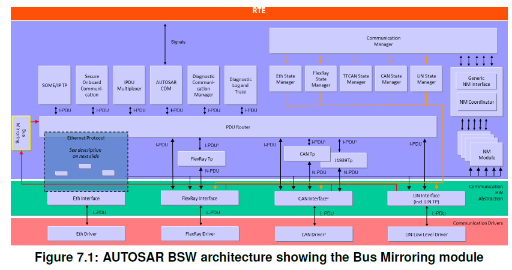
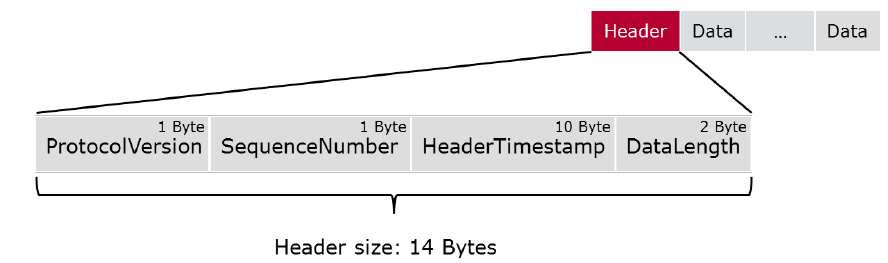
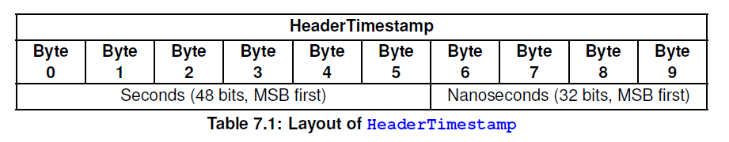

# AUTOSAR Mirror （总线镜像）
# 1. 简介和功能概述

本文档说明了AUTOSAR基本软件模块总线镜像（**Bus Mirroring**）的功能、API和配置。
总线镜像（**Bus Mirroring**）需要AUTOSAR 4.4.0以上版本支持。

总线镜像模块的目的是将内部总线的流量和状态复制到外部总线，这样连接到外部总线的测试设备（**tester**）就可以监控内部总线以进行调试。

通信流量的监控可以通过测试设备发送诊断命令对中间的ECU (**Intermediate ECUs**) (如：网关、子总线控制器) 进行配置。使用诊断协议可以确保在未通过安全检查的情况下，是无法启用镜像功能。

在文档中，术语总线 (**Bus**) 和网络 (**Network**) 可视为同义词。在大多数AUTOSAR规范中，更倾向于使用术语网络 (**Network**) 。因此在引用API参数、配置或协议布局 (**protocol layout**) 时使用它。但该模块被称为总线镜像 (**Bus mirroring**) ，因此在考虑到了镜像方向，比如源总线 (**source bus**) 或目的总线 (**destination bus**) 。

# 2. 相关的规范

AUTOSAR提供了基本软件模块的通用规范，对总线镜像模块来说同样适用。

# 3. 约束和假设

## 3.1. 限制

总线镜像模块不能用于影响配置为源总线 (**source bus**) 上的流量。为了确保这一点，必须避免消息环回 (**loop-back of messages**) 导致总线过载，生成的工具应确保没有总线同时作为源总线和目的总线连接到总线镜像模块。

总线镜像模块通过专用（服务）API由诊断控制应用程序 (**a diagnostic control application**) 控制。诊断仪可以过特殊的诊断服务来控制功能，这些诊断服务由DCM处理，并通过诊断控制应用程序实现。**DCM**提供了必要的安全性，以排除总线镜像的意外激活。总线镜像模块不提供另一个控制接口 (**control interface**) ，也不接收目标总线上的控制消息。

一般来说，总线镜像模块不支持源总线的帧大小超过目标总线，或者源总线包含更多附加信息。

例如以下的内容是不被支持的:
* CANFD转到CAN
* CAN转到LIN
* FlexRay到CAN
* 以太网到CAN
* 以太网到FlexRay。
  
总线镜像模块并不会切分帧的内容。

总线镜像模块只镜像总线接口模块实际接收或传输的流量数据。对于CAN来说，这意味着除了传输帧之外，只有那些通过硬件过滤器的数据帧会被镜像，而远程帧和错误帧不会被镜像。对于LIN，从节点（**Slave**）到从节点（**Slave**）的通信不会被LIN主节点 (**Master**) 镜像。对于FlexRay，只有发送的帧和接收到的帧被分配了接收缓冲区（可能是FIFO），才会被镜像。

总线镜像模块不应该重新序列化接收到的序列化帧，因为这将需要太多的资源。相反，序列化的PDU应该直接路由到目的总线。

总线镜像模块也不支持从以太网转发到以太网。AUTOSAR以太网交换机驱动程序的端口镜像特性已经涵盖了这个用例。

## 3.2. 汽车领域的适用性
总线镜像模块可用于所有带有外部CAN连接器和以太网连接器（Ethernet connectors）的车辆，例如诊断连接器（Diagnostic connector）。

# 4. 对其他模块的依赖关系

总线镜像（**Bus Mirroring**）模块的接口关联到CAN接口（**CanIf**）、LIN接口（**LinIf**）、FlexRay接口（**FrIf**）、PDU路由器（**PduR**）、默认错误跟踪器（**DET**）以及诊断应用程序（**diagnostic application**），它通过AUTOSAR的运行时环境（**RTE**）或者总线镜像模块的复杂驱动程序（**CDD**）API来访问这些服务端口（**service port**）的程序接口API。

总线镜像模块可以包含CanIf、LinIf、FrIf、PduR、DET、StbM和RTE的头文件。

# 5. 功能规格
## 5.1. 概述

总线镜像模块的任务是收集来自几个源总线（**source buses**）的帧，然后将这些帧转发到目标总线（**destination bus**）。转发是严格单向的，从而可以避免消息循环（**message loops**）和阻止入侵场景（**intrusion scenarios**）

下图显示了如何将总线镜像集成到AUTOSAR BSW通信堆栈中：

**总线镜像模块支持以下镜像场景:**
* CAN和LIN总线 => CAN总线 
* CAN、CAN-FD和LIN总线 => CAN-FD总线 
* CAN、CAN-FD、LIN和FlexRay总线 => FlexRay总线 
* CAN、CAN-FD、 LIN和FlexRay总线  => IP总线
* CAN、CAN-FD、LIN和FlexRay总线 => 专有的总线（CDD）
  
为了避免目标总线过载，可以对每个源总线上接收的消息进行筛选。过滤器可以为每个总线进行单独配置，主要通过配置选择（**MirrorSourceCanFilter**、**MirrorSourceLinFilter**和**MirrorSourceFlexRayFilter**）进行配置，也可以在运行时调用程序接口动态配置。

LIN和CAN或者CANFD帧被镜像到CAN或者CANFD总线上，可以直接发送相同的数据。在CAN或者CANFD的场景下，可以保留CAN ID，但可以重新映射CAN ID以避免目的总线上的ID冲突。另一方面，LIN PID总是需要映射到相应的CAN ID。为了避免ID冲突，镜像帧可以使用扩展CAN ID（**extended CAN ID**）范围。

当帧被镜像到FlexRay总线、IP总线（以太网）或作为CDD连接的专有总线时，源帧被将使用指定的协议，封装到一个更大的帧中。当路由到FlexRay总线时，只有那些足够小的FlexRay帧才可以被路由到目标FlexRay帧中，从而减少协议开销。

## 5.2. 模块处理
总线镜像模块通过**Mirror_Init**函数进行模块初始化，通过**Mirror_DeInit**进行反初始化。除了**Mirror_GetVersionInfo**和**Mirror_Init**之外，总线镜像模块的API函数只能在模块正确初始化后被调用。

为了能够测量时间，总线镜像模块通过Mirror_MainFunction循环触发。

### 5.2.1. 源总线的选择（Selection of Active Source Buses）
在初始化时，总线镜像模块将处于非活动状态。没有启用源总线（**source bus**）。要启动总线镜像模块，必须激活一个已配置的源总线（参见MirrorSourceNetwork），这样才能开始收集来自源总线的帧和状态信息。

当使用**Mirror_StartSourceNetwork**使能源总线（**source bus**）时，从该总线获取的帧和状态将被启动，源总线（**source bus**）的状态将被重置，以便在第一次更新后直接报告。

当一个源总线（**source bus**）使用**Mirror_StopSourceNetwork**被禁用时，从该总线获取的帧和状态将被停止。已经收集的帧仍应传输到目的总线（**destination bus**）。要停止镜像，应用程序可以在任何时候调用Mirror_Offline。

当**Mirror_Offline**被调用时，所有的源总线（**source bus**）应该停用，目的总线（**destination bus**）应该重置为**MirrorInitialDestNetworkRef**，所有静态配置的过滤器应该被禁用。同时所有其他的过滤器应该被移除。任何仍在等待传输的镜像帧将被丢弃。

当目标网络改变时，源总线（**source bus**）也被禁用。

### 5.2.2. 目的总线的切换（Switching the Destination Bus）

初始化时，**MirrorInitialDestNetworkRef**配置的目标总线（**MirrorDestNetwork**）会被选中。镜像启动前，需转发的帧和状态信息并不会被发送。

当使用**Mirror_SwitchDestNetwork**更改目的总线时，所有源总线（**source bus**）应被禁用，所有静态配置的过滤器应被禁用，同时所有其他过滤器应被移除。仍在等待传输的镜像帧将被丢弃。这确保了发送到目标总线的信息的选择必须针对该总线类型（**bus type**）进行选择。否则切换到不同的目的地总线（**destination bus**）很容易造成该总线超载（**overload**），特别是当它是另一个内部总线时。

镜像停止时，目标总线（**destination bus**）将被重置。

### 5.2.3. 控制帧的过滤（Controlling Frame Filters）

帧过滤器可以静态配置（**MirrorSourceCanFilter**、**MirrorSourceLinFilter**和**MirrorSourceFlexRayFilter**），也可以在运行时为每个源总线（**source bus**）进行动态配置。

在初始化时，总线镜像模块的所有静态配置的过滤器都被禁用，并且没有可用的动态过滤器。

静态配置的过滤器可以使用**Mirror_SetStaticFilterState**显式地激活和去激活。动态过滤器可以在运行时添加，使用总线特定的**Mirror_Add…Filter**服务（例如**Mirror_AddCanMaskFilter**），并可以通过使用**Mirror_Add...Filter**返回的过滤ID调用**Mirror_RemoveFilter**删除服务。当镜像停止或者目标网络被更改时，过滤器也将被禁用或者删除。

当一个过滤器是激活的（通过调用**Mirror_SetStaticFilterState**激活的静态配置，或者通过使用总线特定的**Mirror_Add…Filter**动态添加的服务），对应源总线上所有匹配过滤的帧都将被镜像。这意味着，只要没有过滤器处于活动状态，源总线就不会镜像任何帧。

当一个静态配置的过滤器被**Mirror_SetStaticFilterState**被停用，或者一个动态添加的过滤器被**Mirror_RemoveFilter**被移除，在停用/移除之前已经被接受的帧仍然会被镜像到目的总线（**destination bus**）。

## 5.3. 访问源总线

总线镜像模块支持CAN、LIN和FlexRay作为源总线（**source bus**）。为了获取这些总线的帧和状态信息，总线镜像模块与相应的总线接口模块进行交互。报告的帧在被镜像到目的总线之前会被过滤。总线镜像模块只能从同一个分区（**same partition**）调用CAN、LIN和FlexRay接口模块的接口，同时还必须是**MirrorSourceNetwork**配置所引用的那个**ComMChannel**所分配的那个通道。

## 5.4. 访问CAN的源总线
总线镜像模块通过CAN接口模块（**CanIf**）访问CAN总线。在总线镜像模块启动CAN总线的镜像后，CanIf模块将接收和发送的CAN帧上报给总线镜像模块。同时在**Mirror_MainFunction**函数中会周期的轮询CAN总线状态（**CAN bus state**）。

### 5.4.1. CAN源总线激活
初始化后，CAN接口模块不会向总线镜像模块报告任何帧。

当Mirror_StartSourceNetwork被调用来启动CAN源总线时，总线镜像模块将调用CanIf_EnableBusMirroring，并将MirroringActive设置为TRUE，来开始报告从相应的CAN控制器接收和发送的CAN帧。

Mirror_StartSourceNetwork接收一个ComMChannelId参数作为网络（network），而CanIf_EnableBusMirroring接收一个CanIfCtrlId参数作为ControllerId。这两个参数的的转换可以在代码生成时，通过ECU配置ComMChannelId到CanIfCtrlId的引用来确定。

当Mirror_StopSourceNetwork被调用来停止CAN源总线时，总线镜像模块将调用CanIf_EnableBusMirroring，并将MirroringActive设置为FALSE，来停止从相应的CAN控制器接收和发送的CAN帧的报告。

### 5.4.2. CAN报文采集

CAN接口模块（CanIf）通过调用Mirror_ReportCanFrame来报告接收和发送的CAN帧。从接收中断或任务中报告接收帧，而从传输确认中断或任务中报告发送帧。

总线镜像模块需要运用适当的机制来确保，Mirror_ReportCanFrame接口能在MirrorComMNetworkHandleRef引用的ComMChannel所分配到的那个分区中被调用。（例如在该分区中提供一个卫星服务（satellite）。

对于上报的每一个CAN帧，CAN接口模块（CanIf）提供接收的CAN控制器、CAN ID、CAN ID类型（扩展帧或标准帧）、CAN帧类型（CAN-FD或CAN 2.0）、帧长度和实际负载信息。

当Mirror_ReportCanFrame被调用来报告接收或发送的CAN帧时，总线镜像模块需要将包含实际CAN ID、ID类型和帧类型的canId与相应源总线中所有活动的静态配置和动态添加的过滤器进行匹配。如果CAN帧至少匹配了一个过滤器，它会被总线镜像模块接受。

当镜像到FlexRay、IP或专有的目的总线时，源总线由network ID标识。但Mirror_ReportCanFrame报告确实cotrollerID。network ID到controllerID的转换，可以在代码生成时确定，通过ECU配置中的MirrorComMNetworkHandleRef里的CanIfCtrlId到MirrorNetworkId的引用来确定。

### 5.4.3. CAN报文的过滤

CAN掩码过滤器（CAN mask filter）可以静态配置为MirrorSourceCanFilterMask的匹配报告的canId，如果该canId被MirrorSourceCanFilterCanIdMask屏蔽掩码计算后等于MirrorSourceCanFilterCanIdCode。

CAN掩码过滤器（CAN mask filter）也可以通过调用Mirror_AddCanMaskFilter动态添加用来匹配报告的canId，如果这个canId被mask参数屏蔽掩码计算后等于id参数。

CAN 范围过滤器（CAN range filter）可以静态配置为MirrorSourceCanFilterRange来匹配报告的canId，如果该canId的值大于等于MirrorSourceCanFilterLower，并且小于等于MirrorSourceCanFilterUpper时，匹配上报的canId。

CAN 范围过滤器（CAN range filter）也可以通过调用Mirror_AddCanRangeFilter动态添加用来匹配上报的canId，如果该canId的值大于等于lowerId参数，并且小于等于upperId参数。

### 5.4.4. CAN状态采集

总线镜像模块通过循环调用Mirror_MainFunction中的CanIf_GetControllerMode和CanIf_GetTrcvMode来轮询每个被激活CAN源总线的状态。如果返回的ControllerModePtr为CAN_CS_STARTED，而TransceiverModePtr为CANTRCV_TRCVMODE_NORMAL，则上报的CAN源总线状态为在线（online），否则为离线（offline）。

如果总线处于在线（online）状态，总线镜像模块调用CanIf_GetControllerErrorState，如果返回的ErrorStatePtr为CAN_ERRORSTATE_PASSIVE或CAN_ERRORSTATE_BUSOFF，则上报的CAN源总线状态分别设置为Passive错误或Bus-off错误。同时如果总线是在线（online）的，总线镜像模块也应该调用CanIf_GetControllerTxErrorCounter，并将返回的TxErrorCounterPtr添加到报告的CAN源总线状态中。

## 5.5. 访问LIN的源总线

总线镜像模块通过LIN接口模块（LinIf）访问LIN总线。Bus Mirroring模块启动LIN总线的镜像后，LIN接口模块将接收和发送的LIN帧报告给总线镜像模块。部分的LIN总线的状态是与LIN帧内容一起被报告，部分状态时通过Mirror_MainFunction循环轮询。

### 5.5.1. LIN源总线激活

初始化后，LIN接口模块（LinIf）不会向总线镜像模块报告任何帧。

当Mirror_StartSourceNetwork被调用来启动LIN源总线时，总线镜像模块应该调用LinIf_EnableBusMirroring并将MirroringActive设置为TRUE，来开始报告从该总线接收和发送的LIN帧。

当Mirror_StopSourceNetwork被调用来停止LIN源总线时，总线镜像模块应该调用LinIf_EnableBusMirroring并将MirroringActive设置为FALSE，来停止从该总线接收和发送LIN帧的报告。

### 5.5.2. LIN帧采集

LIN接口模块通过调用Mirror_ReportLinFrame来报告接收和发送的LIN帧。在执行了相应的状态检查之后，接收和发送的帧被LIN调度处理报告。

总线镜像模块需要运用适当的机制，允许MirrorComMNetworkHandleRef引用的ComMChannel被分配到的分区中调用Mirror_ReportCanFrame。（例如在该分区中提供一个卫星服务（satellite）。
对于每个上报的LIN帧，LIN接口模块（LinIf）提供接收总线、受保护ID (PID)、帧长度、实际负载以及接收或传输状态等信息。

当Mirror_ReportLinFrame被调用来报告接收或发送的LIN帧时，总线镜像模块将从上报的PID中提取帧ID（Frame ID），并将其与相应源总线中所有静态配置和动态添加的活动过滤器进行匹配。如果LIN帧匹配至少一个过滤器，它被总线镜像模块接受。LIN帧的帧ID（Frame ID）是从PID中去掉两个最重要的位来计算的。

### 5.5.3. LIN帧的过滤

LIN掩码过滤器（LIN mask filter）可以静态配置为MirrorSourceLinFilterMask用来匹配报告的frame ID，如果这个frame ID被MirrorSourceLinFilterLinIdMask掩码屏蔽计算后等于MirrorSourceLinFilterLinIdCode。

LIN掩码过滤器（LIN mask filter）也可以通过调用Mirror_AddLinMaskFilter动态添加用来匹配报告的frame ID，如果这个frame ID被mask参数掩码屏蔽计算后等于id参数。

LIN范围过滤器（LIN range filter）可以静态配置为MirrorSourceLinFilterRange用来匹配报告的frame ID，如果这个frame ID的值大于等于MirrorSourceLinFilterLower，并且小于等于MirrorSourceLinFilterUpper。

LIN范围过滤器（LIN range filter）也可以通过调用Mirror_AddLinRangeFilter动态添加用来匹配报告的frame ID，如果这个frame ID的值大于或等于lowerId参数，并且小于或等于upperId参数。

### 5.5.4. LIN状态采集

总线镜像模块应评估Mirror_ReportLinFrame报告的状态。如果是LIN_TX_HEADER_ERROR、LIN_TX_ERROR、LIN_RX_ERROR或LIN_RX_NO_RESPONSE，则上报的LIN源总线状态应设置为报头传输错误（header transmission error）、传输错误（transmission error）、接收错误（reception error）或无响应（no response）。

总线镜像模块通过从Mirror_MainFunction循环调用LinIf_GetTrcvMode来轮询每个激活LIN源总线的状态。如果返回的TransceiverModePtr为LINTRCV_TRCV_MODE_NORMAL，则上报的LIN源总线状态应设置为在线（online），否则设置为离线（offline）。

## 5.6. 访问FlexRay的源总线

总线镜像模块通过FlexRay接口模块(FrIf)访问FlexRay总线。当总线镜像模块启动FlexRay总线的镜像后，FlexRay接口模块将接收到的FlexRay帧上报给总线镜像模块。FlexRay总线状态是通过Mirror_MainFunction循环轮询的。一个FlexRay源总线对应一个FlexRay集群，它可以连接到多个控制器。

### 5.6.1. FlexRay源总线激活

初始化后，FlexRay接口模块不会向总线镜像模块报告任何帧。

当Mirror_StartSourceNetwork被调用来启动FlexRay源总线时，总线镜像模块应该调用FrIf_EnableBusMirroring，并将FrIf_MirroringActive设置为TRUE，开始报告从相应的FlexRay集群接收和发送的FlexRay帧。

Mirror_StartSourceNetwork收到一个ComMChannelId作为网络，而FrIf_EnableBusMirroring期望FrIfClstIdx作为FrIf_ClstIdx。ComMChannelId到FrIf_ClstIdx个的转换可以在代码生成时确定，通过通过ECU配置项的ComMChannelId引用到相关的FrIfClstIdx。

当Mirror_StopSourceNetwork被调用来停止FlexRay源总线时，总线镜像模块应该调用FrIf_EnableBusMirroring, 并将FrIf_MirroringActive设置为FALSE，停止从相应的FlexRay集群接收和发送的FlexRay帧的报告。

### 5.6.2. FlexRay帧采集

FlexRay接口（FrIf）模块通过调用Mirror_ReportFlexRayFrame来报告接收和发送的FlexRay帧。接收和传输的帧由FlexRay接口（FrIf）的作业列表执行函数或传输函数报告。

总线镜像模块应应用适当的机制，允许MirrorComMNetworkHandleRef引用的ComMChannel被分配到的分区中调用Mirror_ReportFlexRayFrame接口。（例如在该分区中提供一个卫星服务（satellite）。

对于每一个上报的FlexRay帧，FlexRay接口模块（FrIf）会提供接收到的FlexRay控制器（FlexRay controller）、Slot ID和周期（cycle）、帧的长度和实际负载，以及传输冲突（transmission conflicts）的信息。

当Mirror_ReportFlexRayFrame被调用来报告一个接收或发送的FlexRay帧（txConflict被报告为FALSE）时，总线镜像模块应该匹配对应源总线中所有静态配置和动态添加的活动过滤器的slotId和cycle参数。如果FlexRay帧匹配至少一个过滤器，它被总线镜像模块接受。

在目标总线上，源总线由网络ID标识，但Mirror_ReportFlexRayFrame报告控制器ID。一个到另一个的转换可以在生成时通过遵循从FrIfCtrlIdx到MirrorNetworkId的引用，通过通过MirrorComMNetworkHandleRef的ECU配置来确定

在目标总线（destination bus）上，源总线由网络ID（network ID）标识，但Mirror_ReportFlexRayFrame却报告是controllerId。controllerId到network ID的转换可以在代码生成时，通过ECU配置的MirrorComMNetworkHandleRef里的FrIfCtrlIdx到MirrorNetworkId的引用来确定。

### 5.6.3. FlexRay帧过滤器

FlexRay过滤器可以静态配置MirrorSourceFlexRayFilter来匹配被报告的slotId和cycle参数。匹配算法为slotId参数大于或等于MirrorSourceFlexRayFilterLowerSlot参数，并且小于或等于MirrorSourceFlexRayFilterUpperSlot；同时cycle参数以MirrorSourceFlexRayFilterCycleRepetition取模，大于或等于 MirrorSourceFlexRayFilterLowerBaseCycle，并且小于等于MirrorSourceFlexRayFilterUpperBaseCycle。

FlexRay滤波器动态添加，可以调用Mirror_AddFlexRayFilter来匹配被报告的slotId和cycle参数。匹配算法为slotId参数大于或等于lowerSlotId，并且小于或等于upperSlotId；同时cycle参数以cycleRepetition取模，大于或等于lowerBaseCycle和小于或等于upperBaseCycle。

### 5.6.4. FlexRay状态采集

当Mirror_ReportFlexRayFrame被调用来报告传输冲突（txConflict被报告为TRUE）时，总线镜像模块应该匹配所被激活的静态配置和动态添加的过滤器的slotId和cycle。如果它至少匹配一个过滤器，该帧所报告的FlexRay源总线状态应设置为传输冲突。

当Mirror_ReportFlexRayChannelStatus被调用来报告FlexRay通道状态时，总线镜像模块将报告的状态与之前报告的状态进行比较。如果第1位（vSS!SyntaxError）、第2位（vSS!ContentError）和第4位（vSS!Bviolation）的状态不同，总线镜像模块应该相应地更新所报告的FlexRay源总线状态。
总线镜像模块通过从Mirror_MainFunction循环调用FrIf_GetState来轮询每个活跃的FlexRay源总线的状态。如果返回的FrIf_StatePtr为FRIF_STATE_ONLINE，则报告的FlexRay源总线状态设置为在线（online），否则设置为离线（offline）。如果总线是在线的，总线镜像模块也需要为每个连接到FlexRay集群的控制器调用FrIf_GetPOCStatus。如果所有控制器返回的Fr_POCStateType为FR_POCSTATE_NORMAL_ACTIVE，则报告的源总线状态应为同步且正常激活。如果Fr_POCStateType对于至少一个控制器是FR_POCSTATE_NORMAL_PASSIVE，则报告的源总线状态应该是同步的，但不是正常活动的。如果Fr_POCStateType处于至少一个控制器的任何其他状态，则报告的源总线状态应该既不是同步的也不是正常活动的。

## 5.7. 镜像协议
总线镜像模块中，镜像协议（Mirroring Protocol）应用于IP、FlexRay和CDD连接的专有网络作为目的总线中。如图所示，在本例中，该协议用于以太网目的总线。

​

协议由一个协议头（Header）和几个数据项组成。

字节数的增加顺序与字节在目的总线上传输的顺序相同，并从0开始。对于字节中位的定义是，一个字节的最高有效位是第7位，最低有效位是0位。

### 5.7.1. 镜像协议头布局（Header）

每个目的帧都有一个协议头，如图所示。

总线镜像目标帧的协议头应按此顺序包含以下字段:
1. ProtocolVersion
1. SequenceNumber
1. HeaderTimestamp
1. DataLength
   
#### 5.7.1.1. 协议版本（ProtocolVersion）

协议版本用来表示协议头和数据项的布局。当前定义的布局固定使用1来标识**ProtocolVersion**。范围[2::127]保留给AUTOSAR标准，用来扩展未来协议定义。客户特定的协议可使用范围[128::255]来定义。

协议版本允许诊断仪（Tester）正确地解释协议，并启用协议的不同布局。

ProtocolVersion字段的宽度为8个Bit。

#### 5.7.1.2. 序列号（SequenceNumber）

SequenceNumber应该随着每一个目的帧的传输而增加。在初始化后或在Mirror_SwitchDestNetwork切换到新的目标总线后，SequenceNumber应该从0重新开始计数。

SequenceNumber允许诊断仪（Tester）识别丢失的目标帧。

SequenceNumber字段的宽度为8个Bit。这意味着SequenceNumber将在达到255后绕圈到0。诊断仪（Tester）必须能够处理这种行为，并且仍然能够正确地对帧进行排序。

#### 5.7.1.3. 协议头时间戳（HeaderTimestamp）

HeaderTimestamp应该反映数据项收集到目的帧开始的时间。这个时间是从1970年1月1日以来的绝对秒数和纳秒数。

HeaderTimestamp字段的宽度应为10字节，布局如图所示。HeaderTimestamp字段的元素应按网络字节顺序（MSB优先）进行编码。

​

#### 5.7.1.4. 数据长度（DataLength）

DataLength应该给出报头后面的字节数。它是目标帧中所有数据项的长度之和。

DataLength字段的宽度应为16位。它应该以网络字节顺序（MSB优先）进行编码。

### 5.7.2. 镜像协议数据项的布局（Data Item Layout）

镜像到FlexRay、IP和CDD当镜像到FlexRay目的总线、IP目的总线（如以太网）或作为CDD连接的专有网络时，总线镜像模块应*1. 用协议将几个较小的帧打包成目标总线的一个大帧。
网络时，总线镜像模块应*1. 目标帧的创建
网络时，总线镜像模块应*1. 当总线镜像模块初始化或当MirrorSwitchDestNetwork被调用时，以激网络时，总线镜像模块应*1. 活FlexRay （MirrorDestNetworkFlexRay)、 IP （MirrorDestNetworkIp）、或专有的（MirrorDestNetworkCdd）目标总线，总线镜像模块将激活#### 一个新的目的地帧缓冲器（destination frame buffer）和重置SequenceNumber为0。
