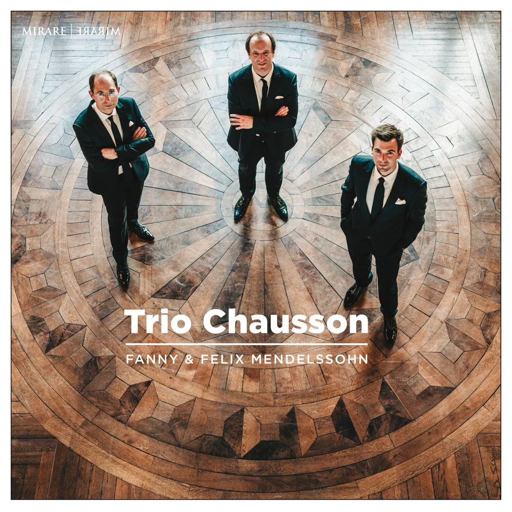

# 1. 范妮·门德尔松（Fanny Mendelssohn）

## 1.1. 生平介绍

范妮·采齐莉·门德尔松（德语：**Fanny Cäcilie Mendelssohn**），结婚后的名字：名范妮·亨塞尔（**Fanny Hensel**）, 1805年11月14日出生于德国汉堡，1847年5月14日卒于普鲁士柏林，德国钢琴家和作曲家，作曲家菲利克斯·门德尔松的姐姐和密友。

据说范妮在音乐上和她弟弟一样有天赋，两个孩子也受教与同一个音乐老师。菲利克斯·门德尔松承认他姐姐的钢琴弹得比他好，范妮在他离家之前一直是他的主要音乐顾问。据说她在13岁的时候就能记住巴赫的完整的《十二律钢琴曲》。

范妮于1829年嫁给了普鲁士宫廷画家威廉·亨塞尔。1839 - 1840年，她和丈夫在意大利旅行。1842年母亲去世后，她接管了门德尔松在柏林的家，在那里她组织当地的音乐会，偶尔还以钢琴家的身份出现。范妮和费利克斯的关系一直很亲密，1847年5月范妮去世，在很大程度上导致了六个月后费利克斯的死亡。

范妮总共写了大约500首音乐作品，包括大约120首钢琴曲，许多抒情歌曲（艺术歌曲），室内乐（**chamber music**），康塔塔（**cantata**）和清唱剧（**oratorio**）。她的六首歌曲以菲利克斯的名义发表在他的两套《十二首歌》（作品8和9）中，而少数作品以她自己的名义发表，包括几首短钢琴作品集，一些抒情歌曲和钢琴三重奏。她剩下的作品大多以手稿形式存在。她的音乐风格与她哥哥的相似。

范妮的儿子塞巴斯蒂安根据范妮的日记和信件写了一本门德尔松家族的传记，其中提供了大量关于她弟弟费利克斯的信息。

## 1.2. 曲目

### 1.2.1. String Quartet in E-Flat Major （H.277）

|      | Name                                                |
| ---- | --------------------------------------------------- |
| I.   | Adagio - Allegro vivace                             |
| II.  | Adagio non lento                                    |
| III. | Intermezzo. Allegretto con molto - Allegro di molto |
| IV   | Presto                                              |

相关录音：

 

| Album  | Felix and Fanny Mendelssohn: String Quartets |
| ------ | -------------------------------------------- |
| Artist | Quatuor Ébène                                |
| Year   | 2013                                         |

### 1.2.2. Piano Trio in D Minor（Op. 11）

|      | Name                 |
| ---- | -------------------- |
| I.   | Allegro molto vivace |
| II.  | Andante espressivo   |
| III. | Lied Allegretto      |
| IV   | Allegretto moderato  |

相关录音：

| Album  |  Fanny & Felix Mendelssohn  |
| ------ | -------------------------------------------- |
| Artist | Trio Chausson                                |
| Year   | 2022                                         |

