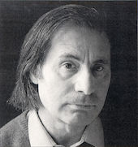

<section id="title">Alfred Schnittke</section>

# 1. 生平介绍

阿尔弗莱德・施尼凯特（**Alfred Schnittke**）1934年11月24日，生于伏尔加河畔的恩格斯（**Engels**）。施尼凯特的父亲哈里·维克托维奇·施尼凯特（**Harry Viktorovich Schnittke**, 1914-1975）是犹太人，出生在法兰克福。1927年，他移居苏联，担任记者和德语翻译。他的母亲（**Maria Iosifovna Schnittke**，1910-1972）是出生于俄罗斯的伏尔加德国人。施尼凯特的祖母（**Tea Abramovna Katz**，1889-1970）是一位语言学家、翻译家和德语文学编辑。

1946年，他在他父亲任职的维也纳开始了音乐教育。施尼凯特的传记作者亚历山大•伊瓦什金写道，正是在维也纳，“他爱上了音乐，这是生活的一部分，是历史和文化的一部分，是仍然存在的过去的一部分。”“我感觉那里的每一刻，”这位作曲家写道，“都是历史链条的一环:一切都是多维的;过去代表着一个鬼魂无处不在的世界，而我不是一个没有任何联系的野蛮人，而是我生命中这个任务的有意识的肩负者。”施尼凯特在维也纳的经历“给了他一定的精神体验和对他未来职业活动的纪律。”莫扎特和舒伯特，而不是柴可夫斯基和拉赫玛尼诺夫，是他在品味、方式和风格上的参照。这个参考点本质上是古典的……但不要太露骨。”

1948年，这家人搬到了莫斯科。施尼凯特于1961年在莫斯科音乐学院完成了他的作曲研究生工作，并从1962年到1972年在那里任教。叶夫根尼·戈卢别夫是他的作曲老师之一。此后，他主要以创作电影配乐为生，在30年里创作了近70首配乐。施尼凯特皈依基督教，并拥有深刻的神秘信仰，这影响了他的音乐。

施尼凯特和他的音乐经常受到苏联官僚机构的怀疑。他的《第一交响曲》实际上被作曲家联盟禁止了。1980年，他在作曲家联盟的投票中弃权后，被禁止出国旅行。1985年，施尼凯特中风，陷入昏迷。他几次被宣布临床死亡，但后来恢复了，并继续镇定下来。

1990年，施尼凯特离开苏联，定居在汉堡。然而，他的健康状况仍然很差。1998年8月3日，他在汉堡去世，享年63岁。在去世之前，他又经历了几次中风。他被安葬在莫斯科的新圣女公墓（**Novodevichy Cemetery**），那里安葬着许多其他著名的俄罗斯作曲家，包括德米特里·肖斯塔科维奇（**Dmitri Shostakovich**）

# 2. 曲目

## 2.1. Suite in the Old Style

|      | Name      |
| ---- | --------- |
| I.   | Pastorale |
| II.  | Ballet    |
| III. | Minuet    |
| IV.  | Fugue     |
| V.   | Pantomime |

相关录音：

* [2021 - Daniel Hope & Alexey Botvinov / Schnittke: Works for Violin and Piano](https://music.apple.com/cn/album/schnittke-works-for-violin-and-piano/1542233773)
